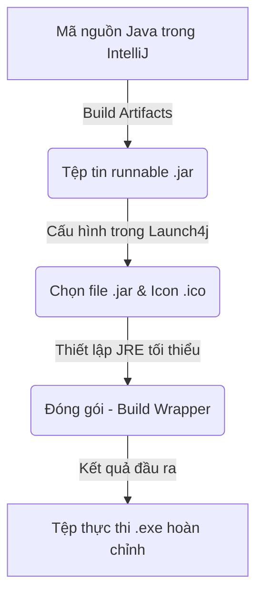

# Tạo tệp thực thi EXE từ chương trình Java

---

## Định nghĩa
Tạo file `.exe` là quá trình đóng gói ứng dụng Java đã biên dịch (file `.jar` runnable) thành tệp thực thi độc lập trên hệ điều hành Windows.

---

## Tác dụng
- **Tiện lợi cho người dùng:** Khách hàng chỉ cần click đúp vào file `.exe` để chạy ứng dụng thay vì gõ lệnh `java -jar app.jar` trong Command Prompt.
- **Tùy biến thương hiệu:** Cho phép thiết lập icon ứng dụng tùy chỉnh (`.ico`) thay vì icon Java mặc định.
- **Quản lý JRE đi kèm:** Đảm bảo phần mềm chạy được ngay cả khi máy tính của khách hàng chưa được cài đặt sẵn Java (JRE).

---

## FLOW

### Bước 1: Đóng gói ứng dụng thành file `.jar` chạy được trong IntelliJ IDEA
1. Vào menu **File** → **Project Structure** (hoặc nhấn `Ctrl + Alt + Shift + S`).
2. Chọn mục **Artifacts** → Click dấu `+` → **JAR** → **From modules with dependencies...**
3. Tại ô **Main Class**, chọn class chính chứa hàm `public static void main`.
4. Nhấn **OK** → **Apply**.
5. Để xuất file, vào menu **Build** → **Build Artifacts...** → Chọn **Build**.
6. File `.jar` sẽ được tạo ra tại thư mục `out/artifacts/...`.

### Bước 2: Chuyển đổi `.jar` thành `.exe` bằng công cụ Launch4j
1. Tải và cài đặt công cụ miễn phí **Launch4j** (từ trang chủ [launch4j.sourceforge.net](http://launch4j.sourceforge.net/)).
2. Mở Launch4j và cấu hình các tab sau:
   - **Tab Basic:**
     - **Output file:** Chọn đường dẫn và đặt tên file `.exe` xuất ra (Ví dụ: `C:\MyApp\app.exe`).
     - **Jar:** Chọn đường dẫn đến file `.jar` đã build ở Bước 1.
     - **Icon:** Chọn file hình ảnh biểu tượng định dạng `.ico`.
   - **Tab JRE:**
     - **Min JRE version:** Nhập phiên bản Java tối thiểu để chạy ứng dụng (Ví dụ: `1.8.0` hoặc `17`).
3. Click vào biểu tượng bánh răng (Build wrapper) trên thanh công cụ của Launch4j.
4. Lưu cấu hình file `.xml` khi được yêu cầu, Launch4j sẽ tiến hành đóng gói và tạo file `.exe` thành công.

---

## Lưu ý
> [!caution] Đóng gói JRE kèm theo
> Nếu muốn ứng dụng chạy hoàn toàn độc lập không cần cài Java trên máy khách, trong tab **JRE** của Launch4j, tại ô **Bundled JRE path**, hãy điền thư mục chứa JRE thu nhỏ (ví dụ: `./jre`) và sao chép thư mục JRE đó đặt bên cạnh file `.exe` khi phân phối cho khách hàng.