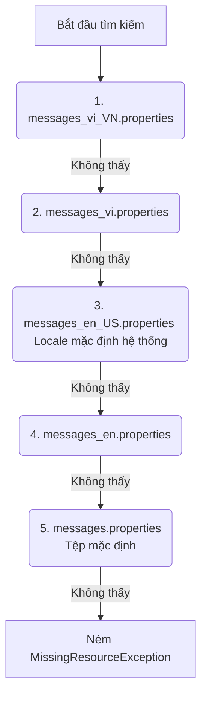
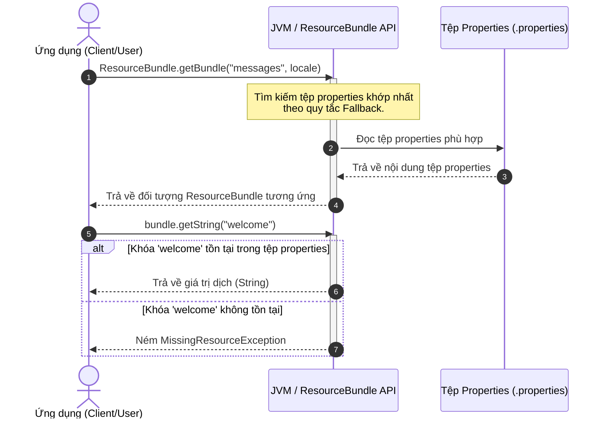

# Java ResourceBundle (Đa ngôn ngữ / Internationalization)

> [!abstract] Định nghĩa
> **`ResourceBundle`** là một lớp thuộc gói `java.util`, được sử dụng để quản lý các tài nguyên phụ thuộc vào ngôn ngữ và quốc gia (locale-specific). Nó đóng vai trò cốt lõi trong việc thực hiện quốc tế hóa (Internationalization - i18n) và địa phương hóa (Localization - l10n) ứng dụng Java bằng cách tự động tải tệp cấu hình `.properties` phù hợp với Locale hiện tại của hệ thống hoặc do người dùng chỉ định.

---

## 1. Quy tắc đặt tên tệp Resource Bundle (Naming Convention)

Để Java có thể nhận diện và tải đúng ngôn ngữ, các tệp tài nguyên phải được lưu dưới dạng `.properties` và tuân thủ quy tắc đặt tên nghiêm ngặt:

$$\text{baseName} + \text{\_language} + \text{\_country} + \text{\_variant} + \text{.properties}$$

Trong đó:
- **`baseName`**: Tên gốc của gói tài nguyên (ví dụ: `messages`, `errors`).
- **`language`**: Mã ngôn ngữ viết thường gồm 2 ký tự theo chuẩn ISO 639 (ví dụ: `vi`, `en`, `ja`).
- **`country`**: Mã quốc gia viết hoa gồm 2 ký tự theo chuẩn ISO 3166 (ví dụ: `VN`, `US`, `JP`).
- **`variant`**: Biến thể hệ điều hành hoặc trình duyệt (ít dùng, ví dụ: `POSIX`).

### Các ví dụ cụ thể:
- `messages.properties` (Tệp mặc định/fallback cuối cùng nếu không tìm thấy bất kỳ ngôn ngữ nào khớp).
- `messages_en.properties` (Tiếng Anh nói chung).
- `messages_en_US.properties` (Tiếng Anh tại Mỹ).
- `messages_vi_VN.properties` (Tiếng Việt tại Việt Nam).

### Cơ chế Fallback của JVM
Khi bạn gọi `ResourceBundle.getBundle("messages", locale)`, JVM sẽ tự động tìm kiếm tệp phù hợp nhất theo thứ tự ưu tiên giảm dần. Giả sử Locale yêu cầu là `Locale.of("vi", "VN")` (Tiếng Việt tại Việt Nam), và Locale mặc định của hệ thống là `en_US` (Tiếng Anh Mỹ):



---

## 2. Luồng xử lý dữ liệu (FLOW) của ResourceBundle

Biểu đồ tuần tự dưới đây mô tả chi tiết cách ứng dụng yêu cầu tài nguyên ngôn ngữ từ `ResourceBundle`:



---

## 3. Bảng tham chiếu các phương thức ResourceBundle phổ biến

| Method / Statement | Tác dụng | Cách dùng / Phạm vi | Lưu ý |
| --- | --- | --- | --- |
| `ResourceBundle.getBundle(String baseName)` | Tải gói tài nguyên dựa trên Locale mặc định của hệ thống. | Khởi tạo (Static method) | Sử dụng Locale của hệ điều hành hiện tại. |
| `ResourceBundle.getBundle(String baseName, Locale locale)` | Tải gói tài nguyên khớp với đối tượng `Locale` cụ thể. | Khởi tạo (Static method) | Hữu ích khi cho phép người dùng thay đổi ngôn ngữ động trên ứng dụng. |
| `getString(String key)` | Trả về chuỗi giá trị tương ứng với khóa `key`. | Truy xuất dữ liệu (Instance method) | Ném ra `MissingResourceException` nếu không tìm thấy khóa. |
| `getKeys()` | Lấy toàn bộ danh sách các khóa tồn tại trong ResourceBundle. | Duyệt dữ liệu (Instance method) | Trả về kiểu `Enumeration<String>`. |
| `containsKey(String key)` | Kiểm tra xem gói tài nguyên có chứa khóa `key` hay không. | Kiểm tra (Instance method) | Tránh gặp lỗi runtime khi truy xuất các khóa lạ. |

---

## 4. Ví dụ thực tế xây dựng tính năng đa ngôn ngữ (i18n) hoàn chỉnh

Dưới đây là một chương trình Java hoàn chỉnh mô phỏng việc đọc lời chào mừng đa ngôn ngữ dựa trên lựa chọn của người dùng.

### Bước 1: Khai báo cấu trúc các tệp Properties

**Tệp mặc định - `messages.properties`**
```properties
welcome=Welcome to our application!
login.success=Login successful.
logout.msg=Goodbye!
```

**Tệp Tiếng Việt - `messages_vi_VN.properties`**
```properties
welcome=Chào mừng bạn đến với ứng dụng!
login.success=Đăng nhập thành công.
logout.msg=Tạm biệt!
```

### Bước 2: Mã nguồn Java thực thi hoàn chỉnh

```java
import java.util.Locale;
import java.util.ResourceBundle;
import java.util.MissingResourceException;

public class InternationalizationApp {
    
    // Khai báo tên cơ sở của các tệp bundle
    private static final String BUNDLE_BASE_NAME = "messages";

    public static void main(String[] args) {
        // 1. Chạy với Locale mặc định của hệ thống
        System.out.println("--- 1. Sử dụng Locale mặc định ---");
        printMessages(Locale.getDefault());

        // 2. Chạy với Locale Tiếng Việt (vi_VN)
        System.out.println("\n--- 2. Sử dụng Locale Tiếng Việt (vi_VN) ---");
        Locale viLocale = Locale.of("vi", "VN");
        printMessages(viLocale);

        // 3. Chạy thử nghiệm cơ chế lỗi và fallback
        System.out.println("\n--- 3. Kiểm tra cơ chế xử lý lỗi ---");
        testMissingKeyAndBundle();
    }

    /**
     * Phương thức in các thông điệp dựa trên Locale truyền vào.
     */
    private static void printMessages(Locale locale) {
        try {
            // Tải ResourceBundle theo Locale chỉ định
            ResourceBundle bundle = ResourceBundle.getBundle(BUNDLE_BASE_NAME, locale);
            
            // Đọc và in dữ liệu
            String welcomeStr = bundle.getString("welcome");
            String loginSuccessStr = bundle.getString("login.success");
            
            System.out.println("Locale hiện tại: " + bundle.getLocale());
            System.out.println("Thông điệp chào mừng: " + welcomeStr);
            System.out.println("Thông điệp đăng nhập: " + loginSuccessStr);
            
        } catch (MissingResourceException e) {
            System.err.println("Không thể tìm thấy tệp properties: " + e.getClassName());
        }
    }

    /**
     * Minh họa cách xử lý khi key không tồn tại hoặc tệp bundle bị thiếu.
     */
    private static void testMissingKeyAndBundle() {
        Locale enLocale = Locale.US;
        ResourceBundle bundle = ResourceBundle.getBundle(BUNDLE_BASE_NAME, enLocale);

        String testKey = "non_existent_key";

        // ✅ Nên làm (Do): Sử dụng containsKey để kiểm tra khóa trước khi lấy giá trị
        if (bundle.containsKey(testKey)) {
            System.out.println(bundle.getString(testKey));
        } else {
            System.out.println("Khóa '" + testKey + "' không tồn tại trong gói ngôn ngữ.");
        }

        // ❌ Tránh (Don't): Gọi trực tiếp getString() trên một khóa không chắc chắn tồn tại
        try {
            System.out.println("Đang cố lấy khóa không tồn tại...");
            bundle.getString(testKey); // Sẽ ném ra MissingResourceException
        } catch (MissingResourceException e) {
            System.err.println("Bắt được lỗi runtime: " + e.getMessage());
        }
    }
}
```

---

## 5. Lưu ý quan trọng

> [!warning]
> - **MissingResourceException:** Nếu JVM không thể tìm thấy tệp tài nguyên phù hợp (ngay cả tệp mặc định) hoặc khóa được yêu cầu không tồn tại, chương trình sẽ ném ra ngoại lệ `MissingResourceException`. Luôn đảm bảo các tệp `.properties` được cấu hình đầy đủ các khóa chính xác 100% (có phân biệt chữ hoa/thường).
> - **Mã hóa ký tự:** Mặc định các tệp `.properties` sử dụng bảng mã ISO-8859-1. Kể từ Java 9 trở đi, Java hỗ trợ đọc tệp properties bằng UTF-8 trực tiếp. Nếu bạn sử dụng các phiên bản cũ hơn Java 9, hãy chuyển các ký tự tiếng Việt có dấu sang mã Unicode escape (ví dụ: `chào` $\rightarrow$ `ch\u00e0o`).
