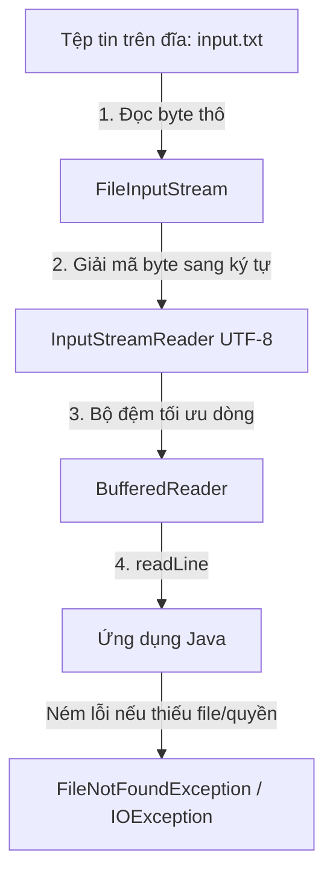

# Java File I/O (Đọc và ghi tệp tin)

> [!abstract] Định nghĩa
> Java cung cấp hai mô hình xử lý nhập xuất tệp tin (File I/O):
> - **Java IO (`java.io`):** Mô hình luồng dữ liệu truyền thống (Stream/Reader/Writer), xử lý tuần tự chặn luồng (blocking I/O).
> - **Java NIO.2 (`java.nio.file` từ Java 7+):** Sử dụng các lớp tiện ích hiện đại `Files` và `Path`, giúp thao tác với hệ thống tập tin dễ dàng, trực quan và hiệu quả hơn.

---

## 1. Đường dẫn tuyệt đối (Absolute Path) vs Đường dẫn tương đối (Relative Path)

Hiểu rõ cách hệ điều hành xác định vị trí tệp tin là yếu tố quan trọng tránh lỗi `FileNotFoundException` khi chạy ứng dụng Java.

### 1.1. Khái niệm và sự khác biệt
- **Đường dẫn tuyệt đối (Absolute Path):** Là đường dẫn đầy đủ, bắt đầu từ gốc của ổ đĩa (Root directory) đến trực tiếp tệp tin. Không phụ thuộc vào nơi chương trình được thực thi.
  - *Ví dụ trên Windows:* `C:\workspace\project-root\data\input.txt`
  - *Ví dụ trên Unix/macOS:* `/home/user/workspace/project-root/data/input.txt`
- **Đường dẫn tương đối (Relative Path):** Là đường dẫn bắt đầu từ thư mục làm việc hiện tại (**Working Directory**) của chương trình.
  - *Ví dụ:* `data/input.txt` (Trỏ đến thư mục `data` nằm bên trong thư mục đang chạy lệnh).

### 1.2. Sơ đồ minh họa cấu trúc thư mục dự án

```
project-root/ (Thư mục gốc dự án - Working Directory)
├── src/
│   └── Main.java (Mã nguồn thực thi)
├── data/
│   └── input.txt (Tệp dữ liệu đầu vào)
└── output/
    └── result.txt (Tệp đầu ra sinh ra khi chạy)
```

Giả sử chương trình được thực thi với Working Directory là `project-root/`:
- Từ file `Main.java`, để truy xuất tệp `input.txt`:
  - **Đường dẫn tương đối:** `data/input.txt` (Hệ thống sẽ tự động ghép thành `<Working_Directory>/data/input.txt`).
  - **Đường dẫn tuyệt đối:** `C:\Users\daolo\OneDrive\Documents\Obsidian Vault\Obsidian-vault\project-root\data\input.txt` (Ví dụ trên Windows).

> [!warning] Lỗi sai Working Directory khi chạy từ IDE vs Terminal
> - **Chạy trong IDE (IntelliJ, Eclipse, VS Code):** IDE mặc định cấu hình Working Directory là thư mục gốc của dự án (`project-root/`). Đường dẫn tương đối `data/input.txt` hoạt động tốt.
> - **Chạy từ Terminal:** Nếu bạn dùng terminal di chuyển vào thư mục `src/` (`cd src`) rồi chạy lệnh `java Main`, hệ thống lúc này coi `src/` là Working Directory. Lúc này đường dẫn tương đối `data/input.txt` sẽ bị hiểu thành `src/data/input.txt` -> Gây lỗi `FileNotFoundException` vì thư mục `data` không nằm trong `src`.

---

## 2. Bảng tham chiếu các phương thức File I/O phổ biến

| Thư viện | Method / Statement | Definition | Tác dụng | Cách dùng / Phạm vi | Lưu ý |
| :--- | :--- | :--- | :--- | :--- | :--- |
| **Path** | `Path.of(String path)` | Khai báo đường dẫn | Khởi tạo đối tượng `Path` trỏ đến tệp tin hoặc thư mục. | Khai báo | Thay thế cho `Paths.get(URI)` từ Java 11+. |
| **Files** | `Files.exists(Path p)` | Kiểm tra tồn tại | Kiểm tra xem tệp tin/thư mục tại đường dẫn `p` có tồn tại trên đĩa không. | Kiểm tra | Tránh lỗi `FileNotFoundException` khi đọc. |
| **Files** | `Files.readString(Path p)` | Đọc nhanh chuỗi văn bản | Đọc toàn bộ nội dung của tệp tin và trả về dưới dạng một chuỗi `String`. | Tệp tin nhỏ-vừa | Có thể gây tràn bộ nhớ (`OutOfMemoryError`) nếu tệp quá lớn. |
| **Files** | `Files.writeString(Path p, CharSequence charSeq)` | Ghi nhanh chuỗi | Ghi trực tiếp toàn bộ chuỗi văn bản vào tệp tin. | Tệp tin nhỏ-vừa | Mặc định sẽ ghi đè nội dung file nếu đã tồn tại. |
| **Files** | `Files.readAllLines(Path p)` | Đọc tất cả dòng | Đọc toàn bộ các dòng trong tệp tin thành danh sách `List<String>`. | Tệp tin nhỏ-vừa | Tiện lợi khi phân tích dòng văn bản đơn giản. |
| **Files** | `Files.deleteIfExists(Path p)` | Xóa an toàn | Xóa tệp tin/thư mục nếu nó tồn tại. | Xóa tài nguyên | Trả về `true` nếu xóa thành công, `false` nếu tệp không tồn tại. |
| **BufferedReader** | `readLine()` | Đọc từng dòng tối ưu | Đọc một dòng văn bản từ luồng đọc, giúp tiết kiệm bộ nhớ cho tệp lớn. | Tệp tin lớn | Trả về `null` khi đọc tới cuối tệp tin (EOF). |
| **BufferedWriter** | `write(String str)` | Ghi dữ liệu bộ đệm | Ghi chuỗi văn bản vào bộ đệm của luồng ghi. | Tệp tin lớn | Cần gọi `flush()` hoặc `close()` để đảm bảo dữ liệu ghi hẳn xuống đĩa. |

---

## 3. Các thao tác cơ bản & Ví dụ thực tế hoàn chỉnh

Dưới đây là 4 thao tác cốt lõi khi làm việc với tệp tin trong Java. Mỗi thao tác đều đi kèm ví dụ đầy đủ, có thể chạy trực tiếp.

### 3.1. Tạo file mới (File Creation)

Thao tác tạo tệp tin mới trên đĩa cứng. Ta có thể dùng phương thức kế thừa từ `java.io.File` hoặc phương thức hiện đại từ `java.nio.file.Files`.

```java
import java.io.File;
import java.io.IOException;
import java.nio.file.Files;
import java.nio.file.Path;

public class CreateFileDemo {
    public static void main(String[] args) {
        // Cách 1: Sử dụng java.io.File truyền thống
        File fileIo = new File("test_io.txt");
        try {
            boolean created = fileIo.createNewFile();
            if (created) {
                System.out.println("Cách 1 (IO): Đã tạo file thành công: " + fileIo.getAbsolutePath());
            } else {
                System.out.println("Cách 1 (IO): File đã tồn tại từ trước.");
            }
        } catch (IOException e) {
            System.err.println("Lỗi khi tạo file (IO): " + e.getMessage());
        }

        // Cách 2: Sử dụng java.nio.file.Files (Khuyến khích cho Java 7+)
        Path pathNio = Path.of("test_nio.txt");
        try {
            if (!Files.exists(pathNio)) {
                Files.createFile(pathNio);
                System.out.println("Cách 2 (NIO): Đã tạo file thành công: " + pathNio.toAbsolutePath());
            } else {
                System.out.println("Cách 2 (NIO): File đã tồn tại từ trước.");
            }
        } catch (IOException e) {
            System.err.println("Lỗi khi tạo file (NIO): " + e.getMessage());
        }
    }
}
```
- **Bối cảnh thực tế (Input/Output):**
  - *Trước khi chạy:* Thư mục làm việc trống.
  - *Sau khi chạy:* Xuất hiện hai tệp tin trống `test_io.txt` và `test_nio.txt` tại thư mục làm việc hiện tại. Màn hình in ra đường dẫn tuyệt đối của cả hai tệp.
- **Lưu ý:** Phương thức tạo tệp sẽ ném ra `IOException` nếu đường dẫn cha không tồn tại hoặc hệ thống không cấp quyền ghi (Permission Denied).

---

### 3.2. Đọc nội dung file (Reading File)

#### FLOW xử lý luồng đọc file (BufferedReader)


Dưới đây là mã nguồn minh họa đọc tệp tin lớn/nhỏ sử dụng `BufferedReader` (truyền thống, tối ưu bộ nhớ) và `Files.readAllLines` (NIO.2, nhanh gọn):

```java
import java.io.BufferedReader;
import java.io.FileReader;
import java.io.IOException;
import java.nio.file.Files;
import java.nio.file.Path;
import java.util.List;

public class ReadFileDemo {
    public static void main(String[] args) {
        String fileName = "sample.txt";

        // Chuẩn bị dữ liệu mẫu cho file (Có thể tạo thủ công trước khi chạy)
        Path filePath = Path.of(fileName);
        try {
            Files.writeString(filePath, "Dòng 1: Học Java File IO\nDòng 2: Antigravity AI\nDòng 3: Kết thúc ví dụ.");
        } catch (IOException ignored) {}

        // --- CÁCH 1: Đọc bằng BufferedReader (Tối ưu cho tệp lớn) ---
        System.out.println("--- Đọc bằng BufferedReader ---");
        // Sử dụng try-with-resources để tự động đóng luồng đọc
        try (BufferedReader reader = new BufferedReader(new FileReader(fileName))) {
            String line;
            int lineCount = 1;
            while ((line = reader.readLine()) != null) {
                System.out.println("Dòng " + lineCount + ": " + line);
                lineCount++;
            }
        } catch (IOException e) {
            System.err.println("Lỗi đọc file bằng BufferedReader: " + e.getMessage());
        }

        // --- CÁCH 2: Đọc toàn bộ dòng bằng Files.readAllLines (Tiện lợi cho tệp nhỏ) ---
        System.out.println("\n--- Đọc bằng Files.readAllLines ---");
        try {
            List<String> lines = Files.readAllLines(filePath);
            for (String line : lines) {
                System.out.println("Đọc được: " + line);
            }
        } catch (IOException e) {
            System.err.println("Lỗi đọc file bằng Files: " + e.getMessage());
        }
    }
}
```
- **Bối cảnh thực tế (Input/Output):**
  - *Input:* Tệp `sample.txt` chứa 3 dòng text tiếng Việt.
  - *Console Output:* In ra màn hình đầy đủ nội dung 3 dòng thông qua cả 2 cách đọc.
- **Lưu ý:** Luôn sử dụng cấu trúc `try-with-resources` để đóng file, tránh hiện tượng rò rỉ tài nguyên hệ thống (Resource Leak) khiến tệp bị khóa.

---

### 3.3. Chỉnh sửa/ghi nội dung file (Writing/Appending File)

Khi ghi file, cần làm rõ yêu cầu ghi đè (Overwrite - xóa sạch nội dung cũ ghi nội dung mới) hay ghi nối tiếp vào cuối file (Append).

```java
import java.io.BufferedWriter;
import java.io.FileWriter;
import java.io.IOException;
import java.nio.file.Files;
import java.nio.file.Path;
import java.nio.file.StandardOpenOption;

public class WriteFileDemo {
    public static void main(String[] args) {
        String fileName = "output.txt";
        Path path = Path.of(fileName);

        // --- THAO TÁC 1: GHI ĐÈ FILE (OVERWRITE) ---
        System.out.println("Đang ghi đè file...");
        try (BufferedWriter writer = new BufferedWriter(new FileWriter(fileName))) {
            writer.write("Nội dung ban đầu (Ghi đè).\n");
            writer.write("Dòng thứ hai của nội dung ban đầu.\n");
        } catch (IOException e) {
            System.err.println("Lỗi ghi đè file: " + e.getMessage());
        }
        printFileContent(path, "Trạng thái sau khi ghi đè:");

        // --- THAO TÁC 2: GHI TIẾP VÀO CUỐI FILE (APPEND) ---
        
        // Cách A: Dùng FileWriter truyền thống (truyền tham số append = true)
        System.out.println("\nĐang ghi nối tiếp bằng FileWriter (append = true)...");
        try (BufferedWriter writer = new BufferedWriter(new FileWriter(fileName, true))) {
            writer.write("Dòng này được ghi tiếp bằng FileWriter.\n");
        } catch (IOException e) {
            System.err.println("Lỗi ghi tiếp (FileWriter): " + e.getMessage());
        }

        // Cách B: Dùng Files.write (NIO.2) truyền StandardOpenOption.APPEND
        System.out.println("Đang ghi nối tiếp bằng Files.write (StandardOpenOption.APPEND)...");
        try {
            Files.writeString(path, "Dòng này được ghi tiếp bằng Files.writeString.\n", StandardOpenOption.APPEND);
        } catch (IOException e) {
            System.err.println("Lỗi ghi tiếp (Files): " + e.getMessage());
        }

        printFileContent(path, "Trạng thái cuối cùng sau khi ghi nối tiếp:");
    }

    private static void printFileContent(Path path, String title) {
        System.out.println(title);
        try {
            System.out.print(Files.readString(path));
        } catch (IOException e) {
            System.err.println("Không thể đọc file: " + e.getMessage());
        }
    }
}
```
- **Bối cảnh thực tế (Input/Output):**
  - *Trước khi chạy:* Tệp `output.txt` chưa tồn tại hoặc chứa dữ liệu cũ khác.
  - *Sau khi chạy:* Tệp `output.txt` được tạo ra. Nội dung ban đầu bị xóa đi và thay thế bằng các dòng ghi đè, tiếp theo là 2 dòng được ghi nối tiếp (`append`).
  - *Console Output:* Hiển thị nội dung tệp ở các trạng thái tương ứng.

---

### 3.4. Lấy danh sách tên các file trong một thư mục (Listing Files)

Liệt kê tất cả các tệp tin và thư mục con nằm trong một thư mục chỉ định.

```java
import java.io.File;
import java.io.IOException;
import java.nio.file.Files;
import java.nio.file.Path;
import java.util.stream.Stream;

public class ListFilesDemo {
    public static void main(String[] args) {
        // Thư mục làm việc hiện tại
        String dirPath = "."; 

        // --- CÁCH 1: Sử dụng File.listFiles() truyền thống ---
        System.out.println("--- Cách 1: Sử dụng File.listFiles() ---");
        File directory = new File(dirPath);
        File[] fileList = directory.listFiles();

        if (fileList != null) {
            for (File file : fileList) {
                String type = file.isDirectory() ? "[Folder]" : "[File]";
                System.out.println(type + " - " + file.getName() + " (Kích thước: " + file.length() + " bytes)");
            }
        } else {
            System.out.println("Thư mục không tồn tại hoặc lỗi đường dẫn.");
        }

        // --- CÁCH 2: Sử dụng Files.list() (NIO.2 - Trả về Stream, tối ưu cho thư mục lớn) ---
        System.out.println("\n--- Cách 2: Sử dụng Files.list() (Stream API) ---");
        Path path = Path.of(dirPath);
        
        // Sử dụng try-with-resources để giải phóng tài nguyên Stream của hệ thống
        try (Stream<Path> stream = Files.list(path)) {
            stream.forEach(p -> {
                String type = Files.isDirectory(p) ? "[Folder]" : "[File]";
                try {
                    System.out.println(type + " - " + p.getFileName() + " (Kích thước: " + Files.size(p) + " bytes)");
                } catch (IOException e) {
                    System.out.println(type + " - " + p.getFileName() + " (Không lấy được thông số)");
                }
            });
        } catch (IOException e) {
            System.err.println("Lỗi liệt kê file: " + e.getMessage());
        }
    }
}
```
- **Bối cảnh thực tế (Input/Output):**
  - *Console Output:* Liệt kê toàn bộ các file và thư mục nằm trong thư mục gốc của project (nơi chạy chương trình), bao gồm kích thước tệp và phân loại rõ ràng folder hay file thông thường.
- **Lưu ý:** `Files.list()` mở ra một luồng trực tiếp với hệ điều hành, do đó bắt buộc phải bọc trong `try-with-resources` để tránh rò rỉ file descriptor.

---

## 4. Lưu ý quan trọng và Các lỗi thường gặp

> [!warning] Giải phóng tài nguyên (Resource Leak)
> Luôn đóng các luồng dữ liệu (Streams, Readers, Writers) sau khi dùng xong để tránh làm khóa tệp tin hoặc tiêu hao bộ nhớ hệ thống. Khuyên dùng cấu trúc **try-with-resources** để đảm bảo tài nguyên tự động đóng kể cả khi xảy ra lỗi.

> [!warning] Tránh OutOfMemory với Files.readString() / readAllLines()
> Phương thức này tải toàn bộ nội dung tệp tin trực tiếp vào Heap Memory. Đừng bao giờ áp dụng nó cho các tệp tin có dung lượng lớn (từ hàng chục Megabytes trở lên). Đối với tệp lớn, hãy dùng `BufferedReader` đọc từng dòng.
