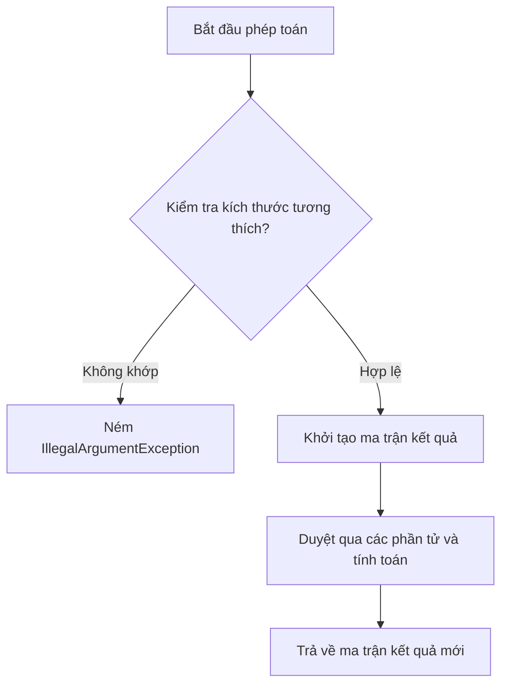

# Phép toán trên Ma trận (Matrix Operations)

> [!info] Yêu cầu
> Xây dựng chương trình Java thực hiện khởi tạo ma trận có kích thước tùy chỉnh, truy xuất/cập nhật phần tử tại vị trí hàng và cột chỉ định, và thực hiện các phép toán cơ bản giữa hai ma trận gồm cộng, trừ, và nhân.

---

## 1. Phân tích yêu cầu & Edge Cases

- **Khởi tạo:** Ma trận được lưu trữ bằng mảng hai chiều kiểu số nguyên (`int[][]`). Có thể khởi tạo ma trận rỗng với kích thước chỉ định hoặc tạo từ một mảng hai chiều có sẵn.
- **Truy cập phần tử:**
  - *Edge Case:* Chỉ số hàng (`row`) và cột (`col`) truy cập phải nằm trong phạm vi kích thước của ma trận. Nếu vượt quá, ném `IllegalArgumentException`.
- **Phép cộng và trừ:**
  - *Điều kiện:* Hai ma trận phải có **cùng kích thước** (cùng số hàng và số cột).
  - *Edge Case:* Nếu kích thước không khớp, ném `IllegalArgumentException`.
- **Phép nhân ma trận ($A \times B$):**
  - *Điều kiện:* **Số cột của ma trận A phải bằng số hàng của ma trận B**.
  - *Edge Case:* Nếu điều kiện trên không thỏa mãn, ném `IllegalArgumentException`.

---

## 2. FLOW



---

## 3. Thư viện sử dụng
Chương trình sử dụng các thư viện chuẩn của Java:
- `java.util.Arrays` (để hỗ trợ hiển thị ma trận).

---

## 4. Code triển khai

```java
import java.util.Arrays;

public class Matrix {
    private final int rows;
    private final int cols;
    private final int[][] data;

    // 1. Khởi tạo ma trận rỗng
    public Matrix(int rows, int cols) {
        if (rows <= 0 || cols <= 0) {
            throw new IllegalArgumentException("Kích thước ma trận phải lớn hơn 0!");
        }
        this.rows = rows;
        this.cols = cols;
        this.data = new int[rows][cols];
    }

    // 2. Khởi tạo ma trận từ mảng 2 chiều có sẵn
    public Matrix(int[][] data) {
        if (data == null || data.length == 0 || data[0].length == 0) {
            throw new IllegalArgumentException("Dữ liệu đầu vào không hợp lệ!");
        }
        this.rows = data.length;
        this.cols = data[0].length;
        this.data = new int[rows][cols];
        for (int i = 0; i < rows; i++) {
            // Sao chép sâu (deep copy) để bảo toàn tính đóng gói
            this.data[i] = Arrays.copyOf(data[i], cols);
        }
    }

    public int getRows() { return rows; }
    public int getCols() { return cols; }

    // 3. Lấy giá trị phần tử
    public int getElement(int row, int col) {
        validateIndices(row, col);
        return data[row][col];
    }

    // 4. Thiết lập giá trị phần tử
    public void setElement(int row, int col, int val) {
        validateIndices(row, col);
        data[row][col] = val;
    }

    // 5. Phép toán Cộng ma trận
    public Matrix add(Matrix other) {
        validateSameDimensions(other);
        Matrix result = new Matrix(rows, cols);
        for (int i = 0; i < rows; i++) {
            for (int j = 0; j < cols; j++) {
                result.data[i][j] = this.data[i][j] + other.data[i][j];
            }
        }
        return result;
    }

    // 6. Phép toán Trừ ma trận
    public Matrix subtract(Matrix other) {
        validateSameDimensions(other);
        Matrix result = new Matrix(rows, cols);
        for (int i = 0; i < rows; i++) {
            for (int j = 0; j < cols; j++) {
                result.data[i][j] = this.data[i][j] - other.data[i][j];
            }
        }
        return result;
    }

    // 7. Phép toán Nhân ma trận
    public Matrix multiply(Matrix other) {
        if (this.cols != other.rows) {
            throw new IllegalArgumentException("Không thể nhân: Số cột ma trận A (" + this.cols + ") phải bằng số hàng ma trận B (" + other.rows + ")!");
        }
        Matrix result = new Matrix(this.rows, other.cols);
        for (int i = 0; i < this.rows; i++) {
            for (int j = 0; j < other.cols; j++) {
                for (int k = 0; k < this.cols; k++) {
                    result.data[i][j] += this.data[i][k] * other.data[k][j];
                }
            }
        }
        return result;
    }

    // 8. In ma trận ra màn hình
    public void print() {
        for (int i = 0; i < rows; i++) {
            System.out.println(Arrays.toString(data[i]));
        }
    }

    // --- Các phương thức bổ trợ private (Helper Methods) ---
    
    private void validateIndices(int row, int col) {
        if (row < 0 || row >= rows || col < 0 || col >= cols) {
            throw new IllegalArgumentException("Chỉ số hàng/cột vượt quá kích thước ma trận!");
        }
    }

    private void validateSameDimensions(Matrix other) {
        if (this.rows != other.rows || this.cols != other.cols) {
            throw new IllegalArgumentException("Kích thước hai ma trận không khớp: (" + this.rows + "x" + this.cols + ") vs (" + other.rows + "x" + other.cols + ")!");
        }
    }

    // --- Hàm main chạy thử nghiệm ---
    public static void main(String[] args) {
        int[][] data1 = {
            {1, 2},
            {3, 4}
        };
        int[][] data2 = {
            {5, 6},
            {7, 8}
        };

        Matrix m1 = new Matrix(data1);
        Matrix m2 = new Matrix(data2);

        System.out.println("Ma trận 1:");
        m1.print();

        System.out.println("Ma trận 1 + Ma trận 2:");
        m1.add(m2).print();

        System.out.println("Ma trận 1 * Ma trận 2:");
        m1.multiply(m2).print();
    }
}
```

---

## 5. Ghi chú & Lưu ý

> [!important]
> - **Sao chép mảng dữ liệu (Deep Copy):** Khi khởi tạo ma trận từ mảng `int[][]` truyền vào, ta sử dụng `Arrays.copyOf()` cho từng dòng để tạo bản sao sâu. Điều này đảm bảo rằng sự thay đổi bên ngoài mảng truyền vào sau khi khởi tạo sẽ không làm ảnh hưởng đến dữ liệu đóng gói bên trong đối tượng `Matrix`.
> - **Tính bất biến của phép toán:** Các phương thức `add`, `subtract`, và `multiply` không chỉnh sửa trực tiếp ma trận hiện tại mà trả về một thực thể `Matrix` mới chứa kết quả tính toán.
