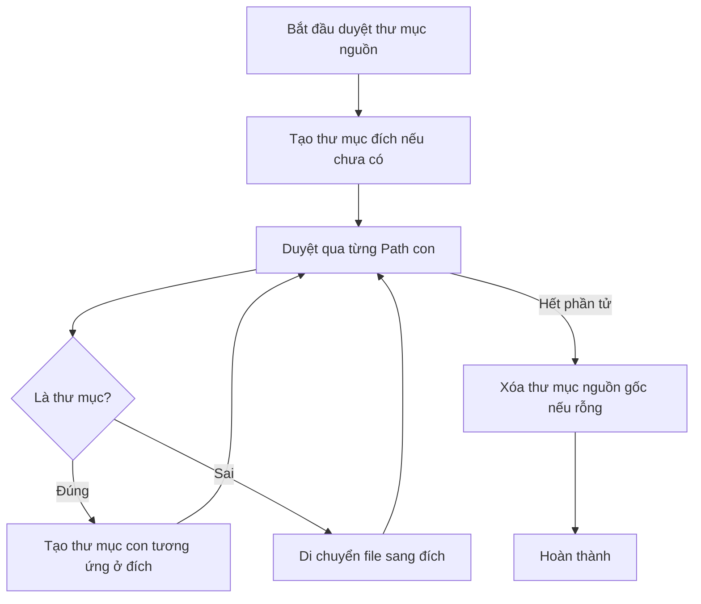

# Thao tác trên File và Folder (File and Folder Operations)

> [!info] Yêu cầu
> Xây dựng chương trình Java thực hiện các thao tác quản lý tệp tin và thư mục bao gồm: tạo file mới, ghi nội dung văn bản vào file, đọc dữ liệu từ file, sao chép (copy) file, và di chuyển (move) toàn bộ nội dung của một thư mục sang thư mục khác.

---

## 1. Phân tích yêu cầu & Edge Cases

Chương trình sử dụng thư viện **Java NIO.2** (`java.nio.file`) được giới thiệu từ Java 7 vì tính an toàn luồng, xử lý ngoại lệ tốt và cú pháp gọn gàng hơn Java IO cũ.

- **Tạo và Ghi file:**
  - *Edge Case:* Thư mục cha chứa file cần tạo có thể chưa tồn tại. Giải pháp: Sử dụng `Files.createDirectories()` để tự động tạo toàn bộ cây thư mục cha trước khi tạo file.
- **Đọc file:**
  - *Edge Case:* File cần đọc không tồn tại. Giải pháp: Sử dụng `Files.exists()` kiểm tra trước hoặc bắt ngoại lệ `NoSuchFileException`.
- **Sao chép file (Copy):**
  - *Edge Case:* File đích đã tồn tại. Giải pháp: Sử dụng tùy chọn `StandardCopyOption.REPLACE_EXISTING` để cho phép ghi đè nếu cần thiết.
- **Di chuyển thư mục (Move Folder Contents):**
  - *Yêu cầu:* Di chuyển toàn bộ các file và thư mục con bên trong thư mục nguồn sang thư mục đích.
  - *Edge Case:* Thư mục đích chưa tồn tại -> Phải tạo thư mục đích trước. Quá trình di chuyển cần duyệt qua các tệp tin, di chuyển từng tệp tin và tạo lại cấu trúc thư mục con tương ứng ở nơi mới.

---

## 2. FLOW

### Quy trình di chuyển nội dung thư mục (Move Folder Contents)


---

## 3. Thư viện sử dụng
- `java.io.IOException`
- `java.nio.file.*`
- `java.util.stream.Stream`

---

## 4. Code triển khai

```java
import java.io.IOException;
import java.nio.file.*;
import java.util.stream.Stream;

public class FileOperations {

    // 1. Tạo file mới (bao gồm tạo các thư mục cha nếu chưa có)
    public static void createFile(Path filePath) throws IOException {
        if (filePath.getParent() != null) {
            Files.createDirectories(filePath.getParent()); // Tạo thư mục cha
        }
        if (!Files.exists(filePath)) {
            Files.createFile(filePath);
        }
    }

    // 2. Ghi văn bản vào file
    public static void writeFile(Path filePath, String content) throws IOException {
        createFile(filePath); // Đảm bảo file tồn tại trước khi ghi
        // Ghi đè nội dung file, sử dụng UTF-8 mặc định
        Files.writeString(filePath, content, StandardOpenOption.TRUNCATE_EXISTING, StandardOpenOption.WRITE);
    }

    // 3. Đọc nội dung file văn bản
    public static String readFile(Path filePath) throws IOException {
        if (!Files.exists(filePath)) {
            throw new NoSuchFileException("File không tồn tại: " + filePath);
        }
        return Files.readString(filePath);
    }

    // 4. Sao chép file (Cho phép ghi đè)
    public static void copyFile(Path source, Path target) throws IOException {
        if (!Files.exists(source)) {
            throw new NoSuchFileException("File nguồn không tồn tại: " + source);
        }
        if (target.getParent() != null) {
            Files.createDirectories(target.getParent()); // Tạo thư mục cha cho file đích
        }
        Files.copy(source, target, StandardCopyOption.REPLACE_EXISTING);
    }

    // 5. Di chuyển toàn bộ nội dung của một thư mục sang thư mục khác
    public static void moveFolderContents(Path sourceDir, Path targetDir) throws IOException {
        if (!Files.isDirectory(sourceDir)) {
            throw new IllegalArgumentException("Đường dẫn nguồn phải là một thư mục!");
        }

        // Tạo thư mục đích nếu chưa có
        Files.createDirectories(targetDir);

        // Sử dụng Files.walk để duyệt qua toàn bộ cây thư mục con và file
        try (Stream<Path> stream = Files.walk(sourceDir)) {
            stream.forEach(sourcePath -> {
                // Tính toán đường dẫn tương đối để ánh xạ sang thư mục đích
                Path relativePath = sourceDir.relativize(sourcePath);
                Path targetPath = targetDir.resolve(relativePath);

                try {
                    if (Files.isDirectory(sourcePath)) {
                        // Nếu là thư mục con, tiến hành tạo ở đích
                        Files.createDirectories(targetPath);
                    } else {
                        // Nếu là file, di chuyển sang đích (ghi đè nếu trùng tên)
                        if (targetPath.getParent() != null) {
                            Files.createDirectories(targetPath.getParent());
                        }
                        Files.move(sourcePath, targetPath, StandardCopyOption.REPLACE_EXISTING);
                    }
                } catch (IOException e) {
                    throw new RuntimeException("Lỗi khi xử lý path: " + sourcePath + " -> " + e.getMessage(), e);
                }
            });
        }

        // Sau khi di chuyển tất cả file bên trong, xóa sạch các thư mục rỗng ở nguồn
        deleteDirectoryRecursively(sourceDir);
    }

    // Phương thức bổ trợ xóa đệ quy thư mục
    private static void deleteDirectoryRecursively(Path dir) throws IOException {
        if (Files.exists(dir)) {
            try (Stream<Path> stream = Files.walk(dir)) {
                stream.sorted((p1, p2) -> p2.compareTo(p1)) // Sắp xếp ngược để xóa file trước, thư mục sau
                      .forEach(p -> {
                          try {
                              Files.delete(p);
                          } catch (IOException e) {
                              // Bỏ qua hoặc log lỗi
                          }
                      });
            }
        }
    }

    // --- Hàm main chạy thử nghiệm ---
    public static void main(String[] args) {
        Path testFile = Paths.get("scratch/test.txt");
        Path copyFile = Paths.get("scratch/copy_test.txt");
        Path srcFolder = Paths.get("scratch/source_dir");
        Path destFolder = Paths.get("scratch/target_dir");

        try {
            // Test Ghi và Đọc file
            writeFile(testFile, "Hello World from Java NIO.2!");
            System.out.println("Đọc nội dung file: " + readFile(testFile));

            // Test Copy file
            copyFile(testFile, copyFile);
            System.out.println("Sao chép file thành công.");

            // Chuẩn bị thư mục nguồn để di chuyển
            writeFile(srcFolder.resolve("sub/data.txt"), "Dữ liệu quan trọng.");
            
            // Test Move thư mục
            moveFolderContents(srcFolder, destFolder);
            System.out.println("Di chuyển toàn bộ thư mục thành công.");

        } catch (IOException e) {
            e.printStackTrace();
        }
    }
}
```

---

## 5. Ghi chú & Lưu ý

> [!important]
> - **Giải phóng tài nguyên Stream:** Khi sử dụng `Files.walk()`, luồng stream liên kết trực tiếp với thư mục hệ thống của OS. Chúng ta **bắt buộc phải bọc trong khối `try-with-resources`** để đảm bảo đóng stream ngay sau khi sử dụng, tránh lỗi rò rỉ tài nguyên hệ thống (resource leak).
> - **Xử lý Exception trong Lambda:** Khối lệnh `forEach` của Stream không cho phép ném trực tiếp `IOException` (checked exception). Vì vậy, ta phải bắt `IOException` bên trong và bọc lại bằng `RuntimeException` (unchecked exception) để dừng luồng xử lý khi gặp sự cố nghiêm trọng.
