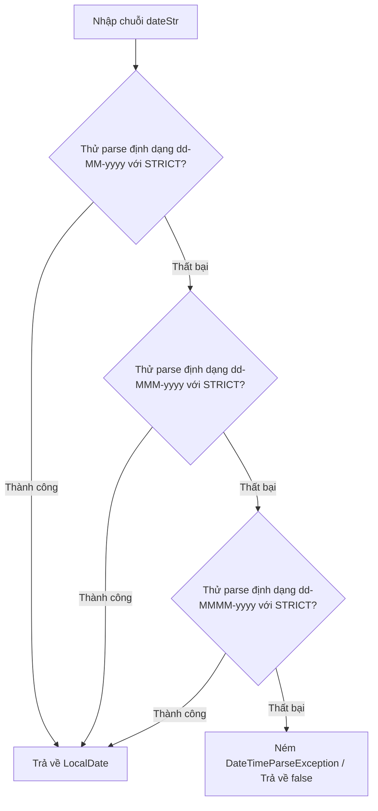

# Validate Ngày dạng String sang LocalDate (Date Validation)

> [!info] Yêu cầu
> Nhập và kiểm tra tính hợp lệ của một chuỗi ký tự ngày tháng (`String`), đảm bảo chuỗi đó có thể được phân tích cú pháp (parse) thành công thành đối tượng `LocalDate` theo một trong các định dạng: `"dd-MM-yyyy"`, `"dd-MMM-yyyy"`, hoặc `"dd-MMMM-yyyy"`. Chương trình phải xử lý chính xác các trường hợp ngày đặc biệt, bao gồm cả ngày **29/02 trong năm nhuận**.

---

## 1. Phân tích yêu cầu & Edge Cases

- **Các định dạng cần kiểm tra:**
  1. `"dd-MM-yyyy"` (ví dụ: `"29-02-2024"`)
  2. `"dd-MMM-yyyy"` (ví dụ: `"29-Feb-2024"` hoặc `"29-Thg 2-2024"` tùy theo Locale)
  3. `"dd-MMMM-yyyy"` (ví dụ: `"29-February-2024"` hoặc `"29-Tháng hai-2024"`)
- **Xử lý năm nhuận:**
  - Năm nhuận là năm chia hết cho 4, nhưng nếu chia hết cho 100 thì phải chia hết cho 400.
  - Ngày 29/02/2024 là hợp lệ vì 2024 là năm nhuận.
  - Ngày 29/02/2023 là **không hợp lệ** vì 2023 không phải năm nhuận.
- **Chế độ kiểm tra nghiêm ngặt (Strict Parsing):**
  - Mặc định, `DateTimeFormatter` của Java hoạt động ở chế độ `SMART`. Chế độ này tự động chuyển đổi các ngày không hợp lệ về ngày hợp lý gần nhất (ví dụ: `"31-04-2023"` sẽ tự động chuyển thành `"30-04-2023"`, `"30-02-2023"` tự động chuyển thành `"28-02-2023"`).
  - Để ngăn chặn hành vi tự sửa lỗi này và đảm bảo kiểm tra tính chính xác tuyệt đối của dữ liệu, ta **bắt buộc phải cấu hình `ResolverStyle.STRICT`** cho formatter.
- **Lưu ý về Locale:**
  - Định dạng tháng bằng chữ (`MMM`, `MMMM`) phụ thuộc vào cấu hình ngôn ngữ của hệ thống. Ta nên cấu hình rõ ràng `Locale.ENGLISH` để đồng bộ xử lý các ký tự tháng tiếng Anh (như `Feb`, `February`).

---

## 2. FLOW



---

## 3. Thư viện sử dụng
- `java.time.LocalDate`
- `java.time.format.DateTimeFormatter`
- `java.time.format.DateTimeParseException`
- `java.time.format.ResolverStyle`
- `java.time.chrono.IsoChronology`
- `java.util.Locale`

---

## 4. Code triển khai

```java
import java.time.LocalDate;
import java.time.chrono.IsoChronology;
import java.time.format.DateTimeFormatter;
import java.time.format.DateTimeFormatterBuilder;
import java.time.format.DateTimeParseException;
import java.time.format.ResolverStyle;
import java.util.Locale;

public class DateValidator {

    // Danh sách các mẫu pattern cần kiểm tra
    private static final String[] PATTERNS = {
        "dd-MM-yyyy",
        "dd-MMM-yyyy",
        "dd-MMMM-yyyy"
    };

    /**
     * Kiểm tra chuỗi ngày đầu vào có hợp lệ theo bất kỳ mẫu định dạng nào không
     * @param dateStr Chuỗi ngày cần kiểm tra
     * @return true nếu hợp lệ, ngược lại false
     */
    public static boolean isValidDate(String dateStr) {
        if (dateStr == null || dateStr.isBlank()) {
            return false;
        }

        for (String pattern : PATTERNS) {
            if (tryParse(dateStr, pattern) != null) {
                return true; // Tìm thấy định dạng khớp và hợp lệ
            }
        }
        return false;
    }

    /**
     * Chuyển đổi chuỗi ngày thành đối tượng LocalDate
     * @param dateStr Chuỗi ngày cần phân tích
     * @return Đối tượng LocalDate hợp lệ
     * @throws DateTimeParseException nếu không khớp bất kỳ định dạng nào
     */
    public static LocalDate parseToLocalDate(String dateStr) {
        if (dateStr == null || dateStr.isBlank()) {
            throw new IllegalArgumentException("Chuỗi ngày không được để trống!");
        }

        for (String pattern : PATTERNS) {
            LocalDate date = tryParse(dateStr, pattern);
            if (date != null) {
                return date;
            }
        }
        throw new DateTimeParseException("Chuỗi ngày không khớp với bất kỳ định dạng yêu cầu nào!", dateStr, 0);
    }

    // Phương thức bổ trợ thực hiện parse nghiêm ngặt
    private static LocalDate tryParse(String dateStr, String pattern) {
        try {
            // Khởi tạo bộ build formatter
            DateTimeFormatter formatter = new DateTimeFormatterBuilder()
                .parseCaseInsensitive() // Cho phép không phân biệt hoa thường (ví dụ: FEB, Feb, feb)
                .appendPattern(pattern)
                .toFormatter(Locale.ENGLISH) // Đồng bộ ngôn ngữ tháng tiếng Anh
                .withChronology(IsoChronology.INSTANCE) // Cố định lịch dương Gregorian
                .withResolverStyle(ResolverStyle.STRICT); // Chế độ phân tích nghiêm ngặt tuyệt đối

            // Tiến hành phân tích cú pháp
            return LocalDate.parse(dateStr, formatter);
        } catch (DateTimeParseException e) {
            return null; // Trả về null nếu không khớp định dạng hoặc sai logic ngày tháng
        }
    }

    // --- Hàm main chạy thử nghiệm ---
    public static void main(String[] args) {
        // Danh sách các test cases
        String[] testDates = {
            "29-02-2024",      // Hợp lệ (Năm nhuận)
            "29-02-2023",      // Không hợp lệ (Năm không nhuận)
            "29-Feb-2024",      // Hợp lệ (Tháng chữ viết tắt)
            "29-february-2024", // Hợp lệ (Tháng chữ đầy đủ, không nhạy chữ hoa thường)
            "31-04-2024",      // Không hợp lệ (Tháng 4 chỉ có 30 ngày)
            "30-02-2024",      // Không hợp lệ (Tháng 2 tối đa 29 ngày)
            "15-Thg 8-2024"    // Không hợp lệ (Sai Locale hệ thống so với Locale.ENGLISH cấu hình)
        };

        for (String dateStr : testDates) {
            boolean isValid = isValidDate(dateStr);
            System.out.print("Chuỗi: \"" + dateStr + "\" -> ");
            if (isValid) {
                System.out.println("Hợp lệ. LocalDate: " + parseToLocalDate(dateStr));
            } else {
                System.out.println("KHÔNG hợp lệ!");
            }
        }
    }
}
```

---

## 5. Ghi chú & Lưu ý

> [!important]
> - **Cấu hình lịch dương `IsoChronology.INSTANCE`:** Khi cấu hình `ResolverStyle.STRICT` với các định dạng có chứa năm (`y`/`yyyy`), Java yêu cầu phải chỉ định rõ hệ thống lịch sử dụng (Chronology) để tránh lỗi không xác định kỷ nguyên (Era). Thêm `.withChronology(IsoChronology.INSTANCE)` giải quyết triệt để lỗi này.
> - **Cho phép không phân biệt hoa thường (`parseCaseInsensitive`):** Việc kết hợp `.parseCaseInsensitive()` giúp người dùng có thể nhập thoải mái `"Feb"`, `"FEB"` hay `"feb"` mà chương trình vẫn nhận dạng và phân tích chính xác.
