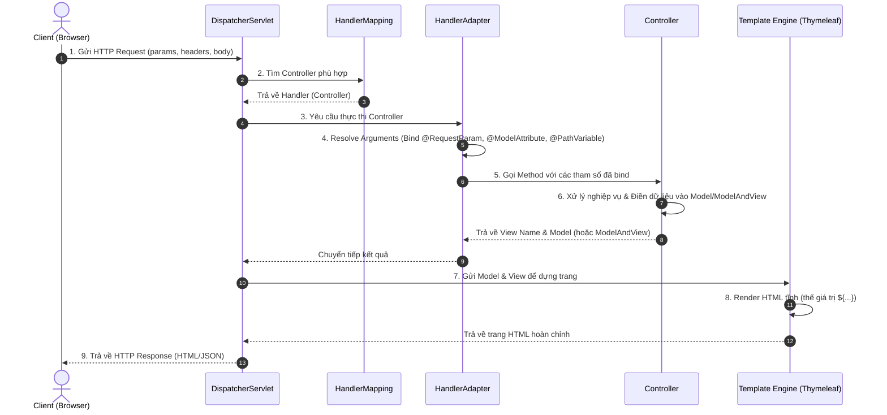

# Spring MVC Controllers

> [!abstract] Định nghĩa
> **Controller** là thành phần trong mô hình MVC chịu trách nhiệm nhận yêu cầu (HTTP Request) từ phía Client, xử lý logic đầu vào, tương tác với tầng Service, và quyết định phản hồi trả về (HTML View hoặc dữ liệu JSON/XML).
> Mọi yêu cầu HTTP đi vào Spring Boot đều được định tuyến qua bộ điều phối trung tâm **`DispatcherServlet`**.

---

## 1. So sánh @Controller vs @RestController

| Tiêu chí | `@Controller` (Spring MVC) | `@RestController` (Spring REST API) |
| --- | --- | --- |
| **Kiểu trả về mặc định** | Tên của View (ví dụ: file HTML Thymeleaf). | Dữ liệu thô (chuỗi JSON, XML, Object). |
| **Bản chất kỹ thuật** | Trả về template để render phía server. | Là tổ hợp của `@Controller` + `@ResponseBody`. |
| **Cách dùng phổ biến** | Xây dựng ứng dụng Server-Side Rendering. | Xây dựng RESTful Web Services cho Single Page App (React, Angular). |

```java
// ✅ Nên làm (Do): Sử dụng @RestController khi viết API.
@RestController
@RequestMapping("/api/users")
public class UserApiController {
    @GetMapping("/{id}")
    public User getUser(@PathVariable Long id) {
        return userService.findById(id); // Tự động convert thành JSON.
    }
}
```

---

## 2. Ánh xạ yêu cầu (Request Mappings) và Nhận tham số

Sử dụng các annotation cụ thể tương ứng với từng HTTP Method để định tuyến URL:
- `@GetMapping`: Lấy dữ liệu (HTTP GET).
- `@PostMapping`: Tạo dữ liệu mới (HTTP POST).
- `@PutMapping`: Cập nhật toàn bộ tài nguyên (HTTP PUT).
- `@DeleteMapping`: Xóa tài nguyên (HTTP DELETE).

### So sánh cách nhận tham số đầu vào

| Annotation | Nguồn dữ liệu trong HTTP Request | Ví dụ URL/Request | Khuyên dùng cho |
| --- | --- | --- | --- |
| **`@PathVariable`** | Trích xuất trực tiếp từ URL Path. | `/users/10` (Với `{id}` = 10) | ID của tài nguyên cụ thể. |
| **`@RequestParam`** | Query String hoặc Form gửi trực tiếp. | `/search?keyword=java` | Tìm kiếm, lọc dữ liệu, phân trang. |
| **`@RequestBody`** | Request Body dạng JSON/XML. | Body: `{"name": "Long"}` | Tạo mới hoặc cập nhật đối tượng (API). |
| **`@ModelAttribute`** | Dữ liệu Form HTML (x-www-form-urlencoded). | Form gửi: `name=Long&age=20` | Liên kết dữ liệu form động với Object (MVC). |

---

## 3. Quản lý trạng thái chuyển hướng (PRG Pattern & Redirect)

### return "viewName" vs return "redirect:/path"
- `return "home"`: Server sẽ tìm và render trực tiếp file `home.html`. Model được giữ nguyên. URL trình duyệt không thay đổi.
- `return "redirect:/dashboard"`: Server trả về mã HTTP 302 Redirect. Trình duyệt gửi một request GET mới tới `/dashboard`. **Toàn bộ dữ liệu của Model cũ bị xóa sạch**.

> [!important] Thiết kế mẫu PRG (Post-Redirect-Get)
> Để tránh việc người dùng nhấn phím F5 gửi lại form trùng lặp dữ liệu (double submit), luôn áp dụng mô hình PRG:
> 1. Nhận form bằng phương thức **POST**.
> 2. Xử lý lưu dữ liệu.
> 3. Trả về lệnh **REDIRECT** sang trang hiển thị kết quả.
> 4. Hiển thị kết quả bằng phương thức **GET**.

---

### Truyền dữ liệu qua Redirect với `RedirectAttributes`

Vì redirect tạo ra một request hoàn toàn mới, ta phải dùng `RedirectAttributes` để gửi dữ liệu:

- **`addAttribute()`:** Gắn dữ liệu trực tiếp lên URL dưới dạng query string (Ví dụ: `redirect:/users?status=success`).
- **`addFlashAttribute()`:** Lưu dữ liệu tạm thời vào Session, tự động xóa đi ngay sau khi render xong request kế tiếp. Dữ liệu **không hiển thị trên thanh URL**, an toàn và thẩm mỹ hơn.

```java
@PostMapping("/register")
public String register(@ModelAttribute User user, RedirectAttributes redirectAttrs) {
    userService.save(user);
    redirectAttrs.addFlashAttribute("message", "Đăng ký thành công!"); // Flash Attribute
    return "redirect:/login"; // URL đích nhận được biến ${message} qua Thymeleaf.
}
```

---

## 4. Case Study: Phân tích 2 cách truyền dữ liệu Form đăng nhập

### Cách 1: Sử dụng ModelAttribute và Form Object (Khuyên dùng)
Phù hợp cho các form lớn cần kiểm tra lỗi (validation).

```java
// GET: Hiển thị form trống
@GetMapping("/login")
public String showForm(Model model) {
    model.addAttribute("loginForm", new LoginForm());
    return "login";
}

// POST: Nhận đối tượng và kiểm tra lỗi
@PostMapping("/login")
public String process(@Valid @ModelAttribute("loginForm") LoginForm form, BindingResult result, HttpSession session) {
    if (result.hasErrors()) {
        return "login"; // Trả lại trang kèm thông báo lỗi
    }
    // Logic authenticate...
    return "redirect:/home";
}
```

### Cách 2: Sử dụng RequestParam cho tham số rời rạc
Phù hợp cho form đăng nhập đơn giản không cần kiểm duyệt kiểu dữ liệu phức tạp.

```java
@PostMapping("/login")
public String login(@RequestParam String username, @RequestParam String password) {
    // Xử lý trực tiếp các tham số rời rạc nhận được từ input HTML name
    return "redirect:/home";
}
```

---

## 5. Luồng truyền nhận dữ liệu giữa Controller ↔ View (Data Binding Flow)

Trong kiến trúc Spring MVC, dữ liệu được luân chuyển hai chiều giữa Client (View) và Server (Controller) thông qua chu kỳ Request-Response.

### Sơ đồ luồng xử lý:



> [!abstract] Bản chất của luồng
> - **Chiều nhận (View → Controller)**: Spring tự động chuyển dữ liệu dạng thô (Query String, Form, JSON) thành các đối tượng Java thông qua các đối tượng phân giải đối số (HandlerMethodArgumentResolver).
> - **Chiều gửi (Controller → View)**: Dữ liệu được đặt vào một Map (`Model` hoặc `ModelMap`) và chuyển giao cho Template Engine để phân tích cú pháp HTML và kết xuất dữ liệu cho trình duyệt.

---

## 6. Bảng tham chiếu các cơ chế Binding dữ liệu

| Thành phần | Chiều dữ liệu | Definition | Tác dụng | Cách dùng / Phạm vi | Lưu ý |
|---|---|---|---|---|---|
| `Model` / `ModelMap` | Controller → View | Interface/Class đóng vai trò là một Map chứa các thuộc tính key-value. | Dùng để truyền dữ liệu từ Controller ra View hiển thị (Thymeleaf, JSP). | Được khai báo làm tham số của phương thức Controller. Sử dụng `.addAttribute(key, value)`. | `Model` là interface, `ModelMap` là lớp triển khai (implement). Spring Boot tự động inject thực thể phù hợp vào method. |
| `ModelAndView` | Controller → View | Holder chứa cả thông tin View Name và Model. | Kết hợp chỉ định tên View cần render và dữ liệu cần truyền đi trong cùng một đối tượng trả về. | Trả về đối tượng `ModelAndView` trực tiếp từ phương thức Controller thay vì trả về `String` tên view. | Thường dùng trong các dự án cũ hoặc khi cần cấu hình View động linh hoạt bằng lập trình. |
| `@RequestParam` | View → Controller | Annotation ánh xạ các Query Parameter hoặc Form Data trong HTTP request vào tham số method. | Nhận dữ liệu đơn lẻ từ URL query string hoặc form input HTML. | Khai báo trước tham số phương thức: `@RequestParam("name") String value`. | Có các thuộc tính `required` (mặc định là `true`), `defaultValue`. Nếu tham số thiếu và `required=true`, Spring sẽ ném lỗi 400 Bad Request. |
| `@ModelAttribute` | View → Controller (và ngược lại) | Annotation liên kết form data (x-www-form-urlencoded) với một Java object hoặc pre-populate dữ liệu cho View. | **Chiều nhận**: Bind dữ liệu form phức tạp trực tiếp vào Object. **Chiều gửi**: Tự động đưa Object đó vào Model để View sử dụng lại. | Khai báo trên tham số method (để bind dữ liệu form) hoặc trên một method riêng biệt (để nạp sẵn dữ liệu cho view trước khi gọi handler). | Rất hữu ích khi làm việc với Spring Form validation. Tên key mặc định trong Model là tên Class viết thường chữ đầu (camelCase). |
| `@PathVariable` | View/URL → Controller | Annotation trích xuất các biến động từ chính đường dẫn URL. | Nhận các định danh tài nguyên trực tiếp từ cấu trúc URI (RESTful URL). | Khai báo biến trong `@RequestMapping` dạng `{param}` và map bằng `@PathVariable("param")`. | Giá trị được bind phải khớp kiểu dữ liệu khai báo, nếu không sẽ xảy ra lỗi chuyển đổi kiểu (TypeMismatchException). |
| `@RequestBody` | Client (JSON/Body) → Controller | Annotation chuyển đổi Body của HTTP request (dạng JSON, XML...) thành đối tượng Java. | Nhận và giải tuần tự hóa (deserialize) dữ liệu payload phức tạp gửi từ Client. | Thường đi kèm với `@PostMapping`/`@PutMapping` trong `@RestController`. Sử dụng thư viện Jackson để parse JSON thành Object. | Yêu cầu Header `Content-Type` của request phải là `application/json` (hoặc tương đương). Không dùng được cho form-data truyền thống. |
| `@ResponseBody` | Controller → Client | Annotation chỉ định kết quả trả về của method sẽ được ghi trực tiếp vào body của HTTP Response. | Bỏ qua việc tìm kiếm và render View, trực tiếp trả về dữ liệu thô (chuỗi hoặc JSON). | Khai báo trên phương thức Controller hoặc trên định nghĩa Class (đã được gộp sẵn trong `@RestController`). | Spring Boot sử dụng các `HttpMessageConverter` (như Jackson) để tự động chuyển đổi đối tượng Java thành định dạng Client yêu cầu (JSON/XML). |

---

## 7. Các ví dụ minh họa thực tế

### 7.1. Truyền dữ liệu với Model / ModelMap
```java
// Controller: Truyền danh sách sản phẩm ra View
@GetMapping("/products")
public String listProducts(Model model) {
    List<String> productList = List.of("Laptop", "Điện thoại", "Bàn phím");
    model.addAttribute("title", "Danh sách sản phẩm nổi bật");
    model.addAttribute("products", productList);
    return "product-list"; // Trả về view name
}
```
```html
<!-- Thymeleaf: templates/product-list.html -->
<!DOCTYPE html>
<html xmlns:th="http://www.thymeleaf.org">
<head>
    <title>Sản phẩm</title>
</head>
<body>
    <h1 th:text="${title}">Tiêu đề mặc định</h1>
    <ul>
        <li th:each="prod : ${products}" th:text="${prod}">Tên sản phẩm</li>
    </ul>
</body>
</html>
```

---

### 7.2. Truyền dữ liệu với ModelAndView
```java
// Controller: Đóng gói View và Model chung trong 1 đối tượng
@GetMapping("/welcome")
public ModelAndView welcomePage() {
    ModelAndView mav = new ModelAndView();
    mav.setViewName("welcome-template"); // Tên view
    mav.addObject("user", "Nguyễn Văn A"); // Dữ liệu model
    mav.addObject("role", "ADMIN");
    return mav;
}
```
```html
<!-- Thymeleaf: templates/welcome-template.html -->
<!DOCTYPE html>
<html xmlns:th="http://www.thymeleaf.org">
<body>
    <h1>Chào mừng, <span th:text="${user}">Khách</span>!</h1>
    <p>Vai trò của bạn: <strong th:text="${role}">USER</strong></p>
</body>
</html>
```

---

### 7.3. Nhận dữ liệu đơn lẻ với @RequestParam
```java
// Controller: Lọc dữ liệu theo tên và phân trang
@GetMapping("/search-devices")
public String searchDevices(
        @RequestParam(name = "q", required = false) String query,
        @RequestParam(name = "page", defaultValue = "1") int page,
        Model model) {
    model.addAttribute("searchQuery", query);
    model.addAttribute("currentPage", page);
    // Logic tìm kiếm...
    return "search-result";
}
```
```html
<!-- Thymeleaf: templates/search-result.html -->
<form th:action="@{/search-devices}" method="get">
    <!-- Nhập từ khóa tìm kiếm -->
    <input type="text" name="q" th:value="${searchQuery}" placeholder="Tìm thiết bị...">
    <input type="hidden" name="page" th:value="${currentPage}">
    <button type="submit">Tìm</button>
</form>
<p>Kết quả tìm kiếm cho: <strong th:text="${searchQuery ?: 'Tất cả'}"></strong></p>
```

---

### 7.4. Nhận và truyền dữ liệu Form với @ModelAttribute
```java
// Đối tượng DTO chứa dữ liệu Form
public class UserRegistrationDto {
    private String email;
    private String password;
    // Getters and Setters...
}

// Controller: Quản lý Form đăng ký
@Controller
@RequestMapping("/register")
public class RegistrationController {

    // Pre-populate: Nạp sẵn đối tượng RegistrationDto vào Model trước khi render view
    @GetMapping
    public String showRegistrationForm(Model model) {
        model.addAttribute("regForm", new UserRegistrationDto());
        return "register-form";
    }

    // Nhận dữ liệu Form gửi lên, tự động validate và redirect
    @PostMapping
    public String processRegistration(@ModelAttribute("regForm") UserRegistrationDto dto, Model model) {
        // Thực hiện đăng ký tài khoản...
        model.addAttribute("registeredEmail", dto.getEmail());
        return "register-success";
    }
}
```
```html
<!-- Thymeleaf: templates/register-form.html -->
<form th:action="@{/register}" th:object="${regForm}" method="post">
    <div>
        <label>Email:</label>
        <input type="email" th:field="*{email}" required />
    </div>
    <div>
        <label>Mật khẩu:</label>
        <input type="password" th:field="*{password}" required />
    </div>
    <button type="submit">Đăng ký</button>
</form>
```

---

### 7.5. Trích xuất tham số động từ URL bằng @PathVariable
```java
// Controller: Nhận chi tiết thiết bị theo ID
@GetMapping("/devices/{deviceId}/details")
public String getDeviceDetails(@PathVariable("deviceId") Long id, Model model) {
    // Tìm kiếm thiết bị theo ID...
    model.addAttribute("deviceId", id);
    return "device-details";
}
```
```html
<!-- Thymeleaf: templates/device-details.html -->
<div>
    <h2>Thông tin chi tiết thiết bị</h2>
    <p>Mã định danh thiết bị (ID): <strong th:text="${deviceId}">0</strong></p>
    <a th:href="@{/devices}">Quay lại danh sách</a>
</div>
```

---

### 7.6. Nhận dữ liệu JSON Payload bằng @RequestBody và trả về JSON bằng @ResponseBody
```java
// Đối tượng đại diện cho Payload JSON gửi lên
public class LoginRequest {
    private String username;
    private String password;
    // Getters and Setters...
}

// Đối tượng API Response trả về
public class ApiResponse {
    private String status;
    private String message;
    
    public ApiResponse(String status, String message) {
        this.status = status;
        this.message = message;
    }
    // Getters and Setters...
}

@RestController // Tích hợp sẳn @ResponseBody cho toàn bộ method bên trong
@RequestMapping("/api/auth")
public class AuthApiController {

    // Nhận JSON payload và trả về JSON response trực tiếp
    @PostMapping("/login")
    public ApiResponse apiLogin(@RequestBody LoginRequest request) {
        if ("admin".equals(request.getUsername()) && "password123".equals(request.getPassword())) {
            return new ApiResponse("SUCCESS", "Đăng nhập hệ thống thành công.");
        }
        return new ApiResponse("FAILURE", "Tên đăng nhập hoặc mật khẩu không đúng.");
    }
}
```
```html
<!-- Client-side View: JavaScript fetch gửi JSON -->
<script>
    async function performLogin() {
        const payload = {
            username: document.getElementById('username').value,
            password: document.getElementById('password').value
        };

        const response = await fetch('/api/auth/login', {
            method: 'POST',
            headers: {
                'Content-Type': 'application/json'
            },
            body: JSON.stringify(payload)
        });

        const result = await response.json();
        alert(result.message); // Hiển thị kết quả dạng JSON trả về từ Controller
    }
</script>
```

