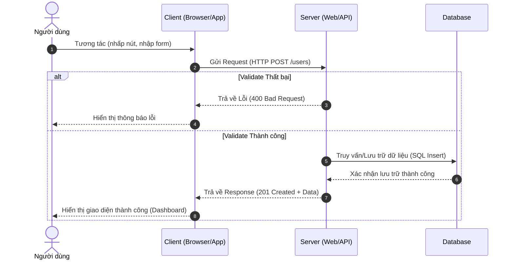

[Wikipedia - Client-Server model](https://en.wikipedia.org/wiki/Client%E2%80%93server_model) | [Microsoft Learn - Client-Server Architecture](https://learn.microsoft.com/en-us/azure/architecture/guide/architecture-styles/client-server)

# Client-Server Architecture

---

## Định nghĩa

**Client-Server** là một mô hình mạng/kiến trúc phần mềm phân tán, trong đó các nhiệm vụ hoặc khối lượng công việc được phân chia giữa nhà cung cấp tài nguyên hoặc dịch vụ (gọi là **Server**) và bên yêu cầu dịch vụ (gọi là **Client**).

---

## Đặc điểm chính

Mô hình Client-Server hoạt động dựa trên cơ chế **Yêu cầu - Phản hồi (Request - Response)**:
- **Client (Phía khách):** Trách nhiệm chính là hiển thị giao diện người dùng (UI) và gửi yêu cầu dịch vụ (Request) đến Server. Client không trực tiếp quản lý hoặc xử lý dữ liệu lớn.
- **Server (Phía máy chủ):** Lắng nghe các yêu cầu từ Client, xử lý logic nghiệp vụ (Business Logic), quản lý tài nguyên/dữ liệu và trả về kết quả (Response) cho Client.
- **Network Protocol:** Giao tiếp giữa Client và Server được thực hiện qua mạng (Internet/Intranet) thông qua các giao thức truyền thông tiêu chuẩn như HTTP/HTTPS, TCP/IP, WebSocket.

---

## FLOW trực quan

Sơ đồ Mermaid dưới đây mô tả luồng Request - Response cơ bản giữa Client và Server:



---

## Ưu điểm / Nhược điểm

> [!info] **Bảng so sánh chi tiết**
>
> | Tiêu chí | Ưu điểm | Nhược điểm |
> | :--- | :--- | :--- |
> | **Quản lý dữ liệu** | Tập trung tại Server giúp dễ bảo mật, sao lưu và quản lý tính nhất quán. | Server là điểm lỗi duy nhất (**Single Point of Failure**). Nếu Server sập, toàn bộ hệ thống ngừng chạy. |
> | **Phân tách Concerns** | Tách biệt giao diện (Client) khỏi logic nghiệp vụ (Server), giúp phát triển song song dễ dàng. | Tải trọng mạng cao do phải liên tục gửi request qua Internet. |
> | **Khả năng Scale** | Dễ dàng nâng cấp tài nguyên Server (Scale up) hoặc thêm nhiều Server (Scale out) đằng sau Load Balancer. | Chi phí duy trì và quản trị Server tập trung lớn khi số lượng người dùng tăng đột biến. |

---

## Khi nào nên dùng

- Các ứng dụng web thông dụng (E-commerce, Social Media, Blog, CMS).
- Hệ thống quản lý doanh nghiệp (ERP, CRM) yêu cầu tính nhất quán cao của dữ liệu tập trung.
- Các ứng dụng cần bảo vệ logic nghiệp vụ bí mật và cơ sở dữ liệu khỏi người dùng cuối.

---

## Ví dụ minh hoá

Một ứng dụng Web quản lý sinh viên đơn giản:
- **Client (Frontend):** Ứng dụng React chạy trên trình duyệt của người dùng. Người dùng click vào nút "Xem danh sách sinh viên", React gửi một HTTP GET Request tới `https://api.university.com/students`.
- **Server (Backend):** Ứng dụng Spring Boot nhận yêu cầu, truy vấn dữ liệu từ MySQL Database, sau đó trả về danh sách sinh viên dưới dạng JSON:
  ```json
  [
    {"id": 1, "name": "Nguyen Van A", "gpa": 3.6},
    {"id": 2, "name": "Tran Thi B", "gpa": 3.8}
  ]
  ```
- **Client** nhận dữ liệu JSON, render ra bảng HTML cho người dùng xem.

---

## Lưu ý

- **Phân biệt với Peer-to-Peer:** Khác với Client-Server vốn dựa trên một máy chủ trung tâm nắm quyền điều khiển, mô hình `[[02 - Peer-to-Peer]]` phân bổ quyền lực và dữ liệu đều cho mọi nút mạng (peers), không có máy chủ tập trung.
- **Bảo mật:** Client là môi trường không tin cậy (Untrusted). Mọi khâu xác thực (Authentication), phân quyền (Authorization) và kiểm tra tính hợp lệ của dữ liệu (Validation) **phải** được thực hiện trên Server thay vì chỉ phụ thuộc vào Client.
