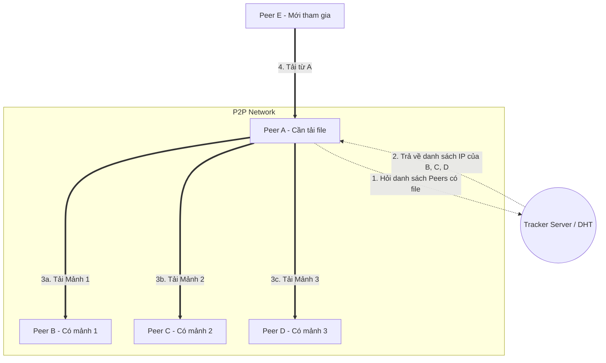

[Wikipedia - Peer-to-peer](https://en.wikipedia.org/wiki/Peer-to-peer)

# Peer-to-Peer (P2P) Architecture

---

## Định nghĩa

**Peer-to-Peer (P2P)** là một kiến trúc mạng phân tán, trong đó các thành viên tham gia vào mạng (gọi là các **Peers** - nút mạng) chia sẻ một phần tài nguyên của chính họ (như năng lượng xử lý, dung lượng lưu trữ ổ đĩa, hoặc băng thông mạng) trực tiếp với các thành viên khác mà không cần thông qua một thực thể điều phối trung tâm (Server).

---

## Đặc điểm chính

- **Mối quan hệ ngang hàng:** Mỗi nút (Peer) vừa đóng vai trò là **Client** (yêu cầu dữ liệu từ nút khác) vừa là **Server** (cung cấp dữ liệu cho nút khác) đồng thời.
- **Không tập trung (Decentralized):** Không có máy chủ trung tâm quản lý. Hệ thống tự tổ chức (Self-organizing) và tự duy trì.
- **Chia sẻ tài nguyên trực tiếp:** Việc truyền tải dữ liệu diễn ra trực tiếp giữa các Peer (Point-to-Point).

---

## FLOW trực quan

Sơ đồ Mermaid dưới đây mô tả luồng tìm kiếm và tải file trong mạng P2P (ví dụ mô hình BitTorrent):

---

## Ưu điểm / Nhược điểm

> [!info] **Bảng so sánh chi tiết**
>
> | Tiêu chí | Ưu điểm | Nhược điểm |
> | :--- | :--- | :--- |
> | **Tính sẵn sàng** | Khả năng chịu lỗi cực cao. Không có điểm lỗi duy nhất (**No Single Point of Failure**). Nếu một nút sập, hệ thống vẫn chạy. | Khó kiểm soát chất lượng dịch vụ và tính toàn vẹn của dữ liệu tải về. |
> | **Khả năng Scale** | Càng nhiều người tham gia, tài nguyên mạng (băng thông, dung lượng) càng mạnh (tự động scale). | Hiệu năng tìm kiếm dữ liệu ban đầu chậm hơn do không có chỉ mục tập trung. |
> | **Chi phí** | Tiết kiệm chi phí đầu tư và duy trì máy chủ trung tâm đắt đỏ. | Khó thực hiện các tác vụ quản trị, bảo mật và cập nhật phần mềm đồng bộ. |

---

## Khi nào nên dùng

- Chia sẻ file dung lượng lớn (BitTorrent).
- Các hệ thống tiền mã hóa, sổ cái phân tán (Blockchain - Bitcoin, Ethereum).
- Giao tiếp thời gian thực không trung gian (WebRTC cho cuộc gọi video trực tiếp).
- Tính toán phân tán hiệu năng cao (Folding@home, SETI@home).

---

## Ví dụ minh hoá

Mạng chia sẻ file Torrent:
1. Bạn muốn tải một file phim dung lượng 10GB.
2. Thay vì tải trực tiếp toàn bộ 10GB từ một máy chủ (dễ gây nghẽn băng thông máy chủ), bạn kết nối vào mạng Torrent.
3. Phần mềm Torrent chia nhỏ file thành hàng ngàn mảnh. Bạn tải các mảnh khác nhau từ hàng chục máy tính khác (Peers) đang bật cùng lúc.
4. Đồng thời, máy tính của bạn cũng upload các mảnh đã tải xong cho những người khác đang cần mảnh đó.

---

## Lưu ý

- **So sánh với Client-Server:** 
  - Trong `[[01 - Client-Server]]`, Server là trung tâm, kiểm soát mọi quyền truy cập và dữ liệu.
  - Trong P2P, tất cả các nút đều bình đẳng. Sự tin cậy được giải quyết bằng các thuật toán đồng thuận (Consensus) hoặc giao thức mã hóa thay vì dựa vào lòng tin đặt vào một bên thứ ba (Server).
- **Vấn đề "Leecher" vs "Seeder":** Hiệu năng của mạng P2P phụ thuộc nhiều vào ý thức cộng đồng. Nếu ai cũng chỉ muốn tải về (Leecher) mà không chịu chia sẻ/upload (Seeder), mạng sẽ suy yếu hoặc sập.
