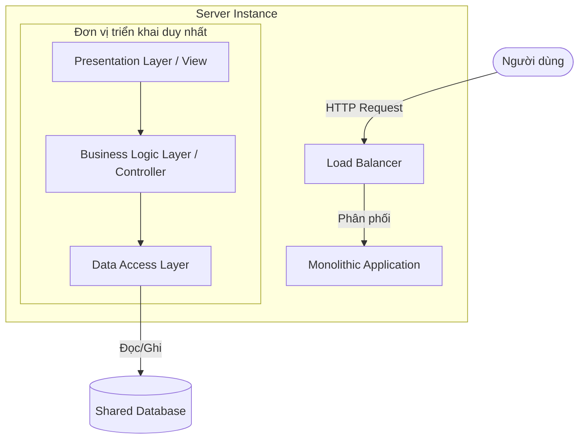

[Microsoft Learn - Monolithic applications](https://learn.microsoft.com/en-us/dotnet/architecture/microservices/architect-microservice-container-applications/monolithic-applications) | [Wikipedia - Monolithic application](https://en.wikipedia.org/wiki/Monolithic_application)

# Monolithic Architecture

---

## Định nghĩa

**Monolithic Architecture (Kiến trúc nguyên khối)** là một mô hình thiết kế phần mềm truyền thống, trong đó toàn bộ ứng dụng được xây dựng thành một đơn vị triển khai duy nhất (Single Deployment Unit). Tất cả các chức năng, logic nghiệp vụ, giao diện người dùng và truy cập dữ liệu đều được đóng gói và chạy chung trong một tiến trình (Process) duy nhất.

---

## Đặc điểm chính

- **Đơn khối thống nhất:** Toàn bộ mã nguồn nằm chung trong một repository lớn (Monorepo), được compile và deploy cùng nhau.
- **Chia sẻ bộ nhớ:** Các module bên trong ứng dụng giao tiếp với nhau bằng cách gọi hàm trực tiếp (Function/Method calls) trên bộ nhớ (In-memory), không qua mạng.
- **Cơ sở dữ liệu dùng chung:** Thường chỉ sử dụng một cơ sở dữ liệu duy nhất (Shared Database) cho toàn bộ ứng dụng.

---

## FLOW trực quan

Sơ đồ Mermaid dưới đây mô tả cấu trúc triển khai và luồng xử lý của một ứng dụng Monolithic:

---

## Ưu điểm / Nhược điểm

> [!info] **Bảng so sánh chi tiết**
>
> | Tiêu chí | Ưu điểm | Nhược điểm |
> | :--- | :--- | :--- |
> | **Phát triển & Debug** | Đơn giản khi bắt đầu. Dễ dàng chạy và debug cục bộ (Local) trên một máy tính. | Dự án lớn dần sẽ khiến mã nguồn trở nên rối rắm (Spaghetti Code), khó đọc và bảo trì. |
> | **Triển khai (Deployment)** | Dễ dàng deploy. Chỉ cần copy một file build duy nhất (như `.war`, `.jar`, `.exe`) lên server. | Thay đổi một dòng code nhỏ cũng bắt buộc phải build lại và redeploy toàn bộ hệ thống. |
> | **Hiệu năng & Network** | Giao tiếp cực nhanh do gọi hàm trực tiếp trong bộ nhớ, không có độ trễ mạng (Network Latency). | Khó scale linh hoạt. Muốn scale một chức năng nặng phải nhân bản toàn bộ ứng dụng lớn lên server mới. |
> | **Công nghệ** | Thống nhất một stack công nghệ (ngôn ngữ, framework). | Bị khóa chặt công nghệ (Technology Lock-in). Rất khó nâng cấp phiên bản framework lớn. |

---

## Khi nào nên dùng

- Các dự án startup khởi đầu, cần kiểm chứng ý tưởng kinh doanh nhanh (MVP - Minimum Viable Product).
- Nhóm phát triển có quy mô nhỏ (dưới 10-12 người).
- Ứng dụng có độ phức tạp nghiệp vụ thấp đến trung bình.
- Ngân sách và tài nguyên vận hành ban đầu hạn chế.

---

## Ví dụ minh hoá

Một ứng dụng thương mại điện tử nguyên khối (E-commerce Monolith) viết bằng Java Spring Boot:
- Toàn bộ code quản lý sản phẩm (`ProductController`), quản lý giỏ hàng (`CartController`), thanh toán (`PaymentController`) nằm chung trong một project Maven.
- Khi build ra file `ecommerce-app.jar`, bạn chạy lệnh `java -jar ecommerce-app.jar` trên server.
- Nếu chức năng thanh toán gặp lỗi Exception gây treo JVM, toàn bộ trang web (bao gồm xem sản phẩm) cũng sẽ bị sập theo.

---

## Lưu ý

- **So sánh với Microservices:** Monolithic và `[[12 - Microservices]]` là hai thái cực đối lập trong thiết kế hệ thống. Trong khi Monolithic gộp tất cả vào một nơi để đơn giản hóa, Microservices lại chia nhỏ thành các dịch vụ độc lập để dễ scale và phát triển song song nhưng phải chấp nhận độ phức tạp cao về quản trị hạ tầng mạng.
- **Monolith không phải là "Bad Practice":** Nhiều hệ thống lớn (như Shopify, Basecamp) vẫn chạy trên kiến trúc Monolithic được thiết kế tốt (Modular Monolith) để tận dụng hiệu năng và sự đơn giản thay vì chuyển sang Microservices vô tội vạ.
