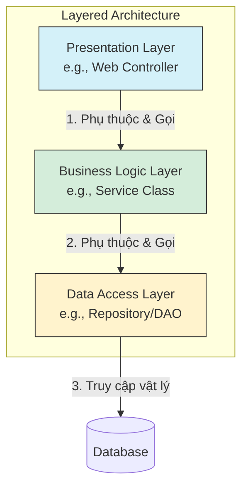

[Microsoft Learn - N-tier architecture style](https://learn.microsoft.com/en-us/azure/architecture/guide/architecture-styles/n-tier) | [Baeldung - Layered Architecture](https://www.baeldung.com/cs/layered-architecture)

# Layered Architecture (N-Tier)

---

## Định nghĩa

**Layered Architecture (Kiến trúc phân tầng)**, hay còn gọi là **N-Tier Architecture**, là một kiến trúc phần mềm phổ biến tổ chức mã nguồn thành các lớp (Layers) riêng biệt. Mỗi lớp có một vai trò và trách nhiệm cụ thể trong hệ thống, và giao tiếp với nhau theo một quy tắc nghiêm ngặt về hướng phụ thuộc.

---

## Đặc đặc điểm chính

Trong mô hình 3 lớp hoặc 4 lớp truyền thống, các tầng được chia như sau:
1. **Presentation Layer (Tầng hiển thị):** Chứa giao diện người dùng (UI) và xử lý tương tác của người dùng (Controller, View).
2. **Business Logic Layer / Service Layer (Tầng nghiệp vụ):** Thực hiện các quy trình, quy tắc nghiệp vụ cốt lõi của ứng dụng.
3. **Data Access Layer / Persistence Layer (Tầng truy cập dữ liệu):** Thực hiện các truy vấn đọc/ghi cơ sở dữ liệu (DAO, Repository).
4. **Database Layer (Tầng cơ sở dữ liệu):** Hệ quản trị CSDL vật lý (MySQL, PostgreSQL...).

**Nguyên tắc phụ thuộc:**
- **Hướng phụ thuộc từ trên xuống dưới (Top-Down Dependency):** Tầng cao hơn phụ thuộc vào tầng ngay dưới nó. Tầng Presentation gọi Service, tầng Service gọi Data Access.
- **Không phụ thuộc ngược:** Tầng dưới không được biết và không phụ thuộc vào tầng trên nó.

---

## FLOW trực quan

Sơ đồ Mermaid dưới đây mô tả cấu trúc phân tầng và chiều phụ thuộc của dữ liệu/logic:



---

## Ưu điểm / Nhược điểm

> [!info] **Bảng so sánh chi tiết**
>
> | Tiêu chí | Ưu điểm | Nhược điểm |
> | :--- | :--- | :--- |
> | **Phát triển độc lập** | Các lập trình viên có thể làm việc song song trên các tầng khác nhau nhờ các Interface trung gian. | Lỗi lan truyền: Thay đổi ở tầng dữ liệu (Database) dễ kéo theo thay đổi ở tầng DAO, Service và UI. |
> | **Dễ bảo trì & Test** | Dễ viết Unit Test bằng cách Mock/Stub các tầng phụ thuộc bên dưới. | **Database-Centric:** Logic nghiệp vụ bị lệ thuộc vào cấu trúc bảng của DB, trái ngược với tư duy Domain-Driven Design (DDD). |
> | **Tính tái sử dụng** | Một Service có thể được tái sử dụng bởi nhiều Controller khác nhau. | Gây dư thừa code (Boilerplate) cho các tác vụ đơn giản (chỉ chuyển tiếp dữ liệu qua các tầng mà không xử lý gì). |

---

## Khi nào nên dùng

- Ứng dụng quản trị thông tin cơ bản, chủ yếu thực hiện các tác vụ CRUD (Create, Read, Update, Delete).
- Các ứng dụng web truyền thống có cấu trúc đơn giản, dễ hiểu đối với các lập trình viên mới.
- Hệ thống nhỏ đến trung bình, ưu tiên tốc độ phát triển ban đầu nhanh hơn là cấu trúc mở rộng linh hoạt.

---

## Ví dụ minh hoá

Cấu trúc thư mục của một ứng dụng Spring Boot phân tầng truyền thống:
```text
com.university.studentmanagement
│
├── controller      <-- Presentation Layer
│   └── StudentController.java
├── service         <-- Business Logic Layer
│   └── StudentService.java
├── repository      <-- Data Access Layer (Persistence)
│   └── StudentRepository.java
└── model           <-- Entity / Data Structure
    └── Student.java
```
- `StudentController` chỉ gọi các method của `StudentService`.
- `StudentService` xử lý logic (ví dụ: tính GPA) rồi gọi `StudentRepository` để lưu vào DB.

---

## Lưu ý

- **So sánh với Clean/Hexagonal Architecture:** 
  - Trong Layered Architecture, toàn bộ hệ thống bị phụ thuộc vào **Database Layer** nằm ở dưới cùng. Nếu thay đổi công nghệ Database (ví dụ từ MySQL sang MongoDB), toàn bộ các lớp phía trên đều bị ảnh hưởng.
  - Trong `[[08 - Hexagonal Architecture]]` và `[[09 - Clean Architecture]]`, nguyên tắc **Dependency Inversion** được áp dụng triệt để. Logic nghiệp vụ (Domain) đặt ở trung tâm và không phụ thuộc vào bất kỳ công nghệ bên ngoài nào (Database, UI, Network). Chúng đều phụ thuộc vào Core Domain thông qua các *Ports / Interfaces*.
- **Phân biệt Lớp (Layer) vs Tầng vật lý (Tier):** 
  - *Layer* là sự phân chia logic mã nguồn trong cùng một phần mềm (chạy chung tiến trình).
  - *Tier* là sự phân chia vật lý trên các máy chủ khác nhau (ví dụ: client-tier chạy ở browser, web-tier chạy ở server 1, db-tier chạy ở server 2).
