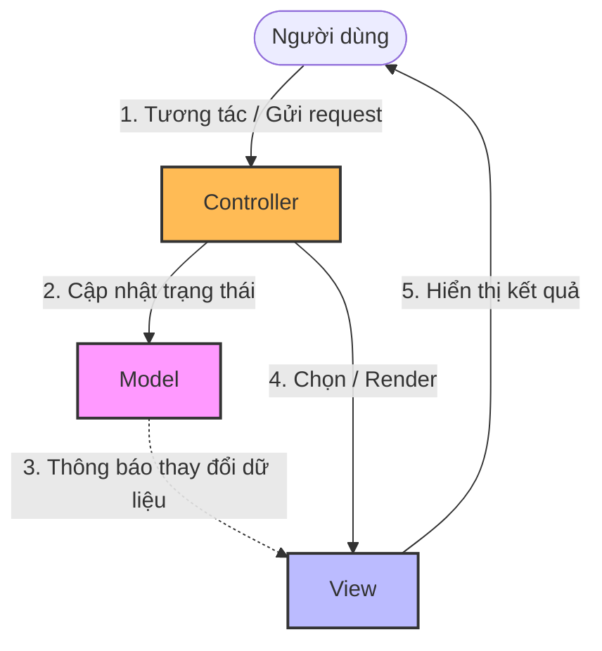

[MDN Web Docs - MVC](https://developer.mozilla.org/en-US/docs/Glossary/MVC) | [Wikipedia - Model-view-controller](https://en.wikipedia.org/wiki/Model%E2%80%93view%E2%80%93controller)

# Model-View-Controller (MVC) Pattern

---

## Định nghĩa

**Model-View-Controller (MVC)** là một mẫu kiến trúc phần mềm được sử dụng rộng rãi để phát triển giao diện người dùng (User Interface). MVC chia ứng dụng thành ba thành phần chính có tính liên kết lỏng lẻo (loose coupling) nhằm tách biệt việc biểu diễn thông tin khỏi tương tác của người dùng với thông tin đó.

---

## Đặc đặc điểm chính

Ba thành phần cốt lõi của MVC bao gồm:
1. **Model (Mô hình):** Quản lý trạng thái, dữ liệu và logic nghiệp vụ của ứng dụng. Model trực tiếp giao tiếp với cơ sở dữ liệu. Nó không biết gì về View hay Controller.
2. **View (Khung nhìn):** Trực quan hóa dữ liệu từ Model và hiển thị giao diện cho người dùng. View là thành phần thụ động, chỉ hiển thị những gì được cung cấp.
3. **Controller (Bộ điều khiển):** Đóng vai trò trung gian. Nó đón nhận các tương tác/sự kiện từ người dùng thông qua View (hoặc request trực tiếp), xử lý logic điều hướng, cập nhật dữ liệu trong Model và chọn View phù hợp để hiển thị lại cho người dùng.

---

## FLOW trực quan

Sơ đồ Mermaid dưới đây mô tả luồng tương tác và luồng dữ liệu (trên Web MVC truyền thống):



---

## Ưu điểm / Nhược điểm

> [!info] **Bảng so sánh chi tiết**
>
> | Tiêu chí | Ưu điểm | Nhược điểm |
> | :--- | :--- | :--- |
> | **Tách biệt Concerns** | Frontend (View) và Backend (Model/Controller) có thể phát triển độc lập mà không ảnh hưởng lẫn nhau. | Tăng độ phức tạp của hệ thống đối với các ứng dụng nhỏ hoặc trang web tĩnh. |
> | **Tái sử dụng View** | Một Model có thể được hiển thị bởi nhiều View khác nhau (ví dụ: dạng bảng, dạng biểu đồ tròn). | **Fat Controller:** Controller dễ bị phình to do ôm đồm quá nhiều logic điều phối và logic nghiệp vụ. |
> | **SEO Friendly** | Phù hợp với cơ chế Server-Side Rendering (SSR), giúp các công cụ tìm kiếm dễ dàng index nội dung trang web. | Việc debug luồng dữ liệu phức tạp hơn do sự tương tác qua lại giữa 3 thành phần. |

---

## Khi nào nên dùng

- Ứng dụng web truyền thống sử dụng Server-Side Rendering (như Spring MVC, ASP.NET MVC, Ruby on Rails, Laravel).
- Ứng dụng cần phân chia rõ ràng vai trò giữa Designer (thiết kế HTML/CSS ở View) và Developer (lập trình logic ở Controller/Model).

---

## Ví dụ minh hoá

Một ứng dụng xem thông tin sản phẩm viết bằng Spring Boot MVC:
- **Model:** Lớp `Product.java` lưu trữ thông tin sản phẩm.
- **View:** File `product-detail.html` (Thymeleaf template) chứa code HTML hiển thị tên và giá sản phẩm.
- **Controller:** Lớp `ProductController.java` đón nhận request URL `/product/1`:
  ```java
  @Controller
  public class ProductController {
      @Autowired
      private ProductService productService;

      @GetMapping("/product/{id}")
      public String getProductDetail(@PathVariable Long id, Model model) {
          Product product = productService.findById(id);
          model.addAttribute("product", product); // Đẩy dữ liệu vào Model
          return "product-detail"; // Trả về tên file View để render
      }
  }
  ```

---

## Lưu ý

- **So sánh MVC vs MVVM:**
  - Trong MVC, Controller điều phối trực tiếp luồng dữ liệu và quyết định View nào được hiển thị. View và Model có thể có liên kết gián tiếp hoặc trực tiếp tùy biến thể.
  - Trong `[[07 - MVVM]]` (Model-View-ViewModel), thành phần Controller được thay thế bằng **ViewModel**. Giữa View và ViewModel có cơ chế **Data Binding** tự động (2-way data binding). ViewModel không hề biết về View, giúp tăng cường khả năng viết Unit Test độc lập cho UI logic.
- **Mã nguồn sạch:** Tránh đưa logic nghiệp vụ (như tính toán, kiểm tra nghiệp vụ phức tạp) vào Controller. Hãy áp dụng nguyên tắc *"Thin Controller, Fat Model"* hoặc chuyển logic nghiệp vụ sang một lớp Service riêng biệt.
