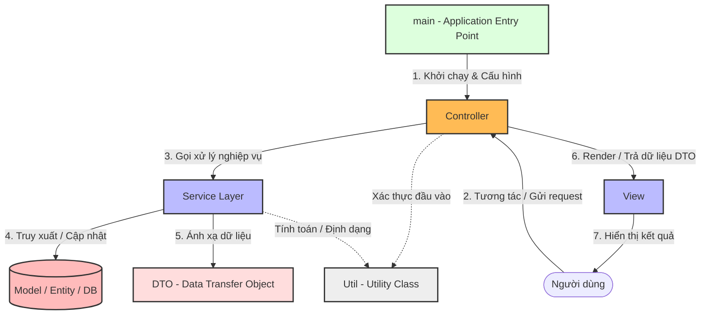

[Baeldung - MVC Architecture with Service and DTO](https://www.baeldung.com/java-mvc-service-layer-dto) | [Oracle - Java EE Patterns](https://docs.oracle.com/cd/E19623-01/818/1196/index.html)

# MVC + Service Layer + DTO Architecture

---

## Định nghĩa

**MVC mở rộng (MVC + Service Layer + DTO + Utility)** là mô hình kiến trúc phần mềm nâng cấp từ mô hình [[05 - MVC]] truyền thống. Kiến trúc này giải quyết vấn đề phình to bộ điều khiển (Fat Controller) và phình to thực thể dữ liệu (Fat Model) trong các ứng dụng thực tế quy mô vừa và lớn bằng cách tách biệt rõ ràng Business Logic (Service), truyền tải dữ liệu (DTO), và các thành phần bổ trợ (Utility).

---

## Đặc điểm chính

Mô hình mở rộng phân chia hệ thống thành các tầng chức năng chuyên biệt:

1. **main (Application Entry Point):** Điểm khởi chạy của toàn bộ chương trình, chịu trách nhiệm cấu hình ứng dụng, khởi tạo và liên kết các tầng (Dependency Injection).
2. **controller (Tầng điều phối):** Nhận đầu vào (HTTP Request, CLI Input...), thực hiện xác thực định dạng đầu vào cơ bản (Validation), chuyển tiếp công việc cho Service phù hợp, nhận kết quả và chọn View hoặc chuyển đổi dữ liệu để hiển thị.
3. **service (Tầng Business Logic):** Nơi xử lý logic nghiệp vụ chính của ứng dụng (ví dụ: tính toán thuế, gửi email, kiểm tra điều kiện giao dịch). Service gọi đến tầng dữ liệu (Model/Repository) và ánh xạ dữ liệu thành DTO.
4. **model / entity (Tầng dữ liệu/Domain):** Đại diện cho cấu trúc bảng trong cơ sở dữ liệu và các thực thể nghiệp vụ (Domain Entities). Chứa logic nghiệp vụ gắn liền với thực thể đó.
5. **dto (Data Transfer Object):** Đối tượng dùng để vận chuyển dữ liệu giữa các tầng (thường từ Service ra Controller và View). DTO chỉ chứa các trường thông tin cần thiết cho Client, không chứa logic nghiệp vụ và giúp che giấu cấu trúc database thật.
6. **view (Tầng hiển thị):** Nhận DTO từ Controller và kết xuất giao diện (HTML/JSON/UI Component) cho người dùng cuối.
7. **util (Utility - Các hàm tiện ích dùng chung):** Các module độc lập cung cấp hàm tiện ích như `DateUtil`, `InputChecker`, `StringFormatter`. Được gọi hỗ trợ ở nhiều tầng (chủ yếu là `controller` và `service`).

---

## FLOW trực quan

Sơ đồ dưới đây mô tả chiều đi của dữ liệu qua từng tầng và vị trí hỗ trợ của Utility:



---

## Ưu điểm / Nhược điểm

> [!info] **Bảng so sánh chi tiết mô hình mở rộng**
>
> | Tiêu chí | Ưu điểm | Nhược điểm |
> | :--- | :--- | :--- |
> | **Tính tách biệt (SoC)** | Tách biệt hoàn hảo: Controller chỉ điều phối, Service chỉ làm logic, Entity chỉ map Database, DTO chỉ chứa thông tin hiển thị. | Số lượng file/lớp tăng lên đáng kể ngay cả với chức năng CRUD đơn giản. |
> | **Bảo mật & Tối ưu** | DTO che giấu hoàn toàn các cột nhạy cảm của Database (ví dụ: mật khẩu hash, quyền hạn nội bộ) khỏi client. | Cần viết thêm code boilerplate để ánh xạ (mapping) giữa Entity và DTO. |
> | **Khả năng kiểm thử (Testability)** | Dễ dàng viết Unit Test cho tầng Service độc lập bằng cách mock tầng Repository/Database và Controller. | Tăng thời gian làm quen và làm việc đối với lập trình viên mới. |

---

## Khi nào nên dùng

- Ứng dụng Web / API quy mô vừa và lớn (như Spring Boot, ASP.NET Core, NestJS).
- Dự án có cơ sở dữ liệu phức tạp nhưng giao diện (View) chỉ cần hiển thị một tập con dữ liệu đơn giản.
- Khi cần xây dựng API bảo mật, cần kiểm soát chặt chẽ thông tin trả về cho phía Client.

---

## Ví dụ minh hoá

Một ứng dụng lấy thông tin chi tiết của người dùng trong hệ thống Java:

- **Entity (Model):** Lớp đại diện cho cơ sở dữ liệu, chứa thông tin nhạy cảm.
  ```java
  public class User {
      private Long id;
      private String username;
      private String passwordHash; // Dữ liệu nhạy cảm
      private String email;
      // Getters & Setters
  }
  ```
- **DTO (Data Transfer Object):** Chỉ hiển thị thông tin an toàn.
  ```java
  public class UserDTO {
      private String username;
      private String email;
      // Constructor nhận từ Entity
      public UserDTO(User user) {
          this.username = user.getUsername();
          this.email = user.getEmail();
      }
  }
  ```
- **Service Layer (Logic nghiệp vụ):**
  ```java
  public class UserService {
      private UserRepository userRepository;

      public UserDTO getUserDetail(Long id) {
          User user = userRepository.findById(id);
          if (user == null) return null;
          return new UserDTO(user); // Chuyển đổi sang DTO tại đây
      }
  }
  ```
- **Controller Layer:**
  ```java
  public class UserController {
      private UserService userService;

      public void handleRequest(Long userId) {
          // Gọi util xác thực ID trước khi gửi xuống service
          if (!InputChecker.isValidId(userId)) {
              System.out.println("ID không hợp lệ!");
              return;
          }
          UserDTO userDto = userService.getUserDetail(userId);
          displayView(userDto);
      }
  }
  ```

---

## Lưu ý

- **Tránh trùng lặp với MVC gốc:** Điểm mấu chốt của MVC mở rộng là sự xuất hiện của **Service Layer** và **DTO**. Trong [[05 - MVC]] truyền thống, Model liên kết trực tiếp với View và Controller gánh vác cả Business Logic. Ở mô hình này, Controller hoàn toàn "mỏng" (Thin Controller), không can thiệp vào nghiệp vụ mà chỉ làm nhiệm vụ giao tiếp.
- **Sử dụng thư viện chuyển đổi DTO:** Để giảm thiểu boilerplate code khi map Entity sang DTO, khuyến khích sử dụng các thư viện tự động như **MapStruct**, **ModelMapper** (trong Java) hoặc các mapper tương ứng trong ngôn ngữ lập trình của dự án.
