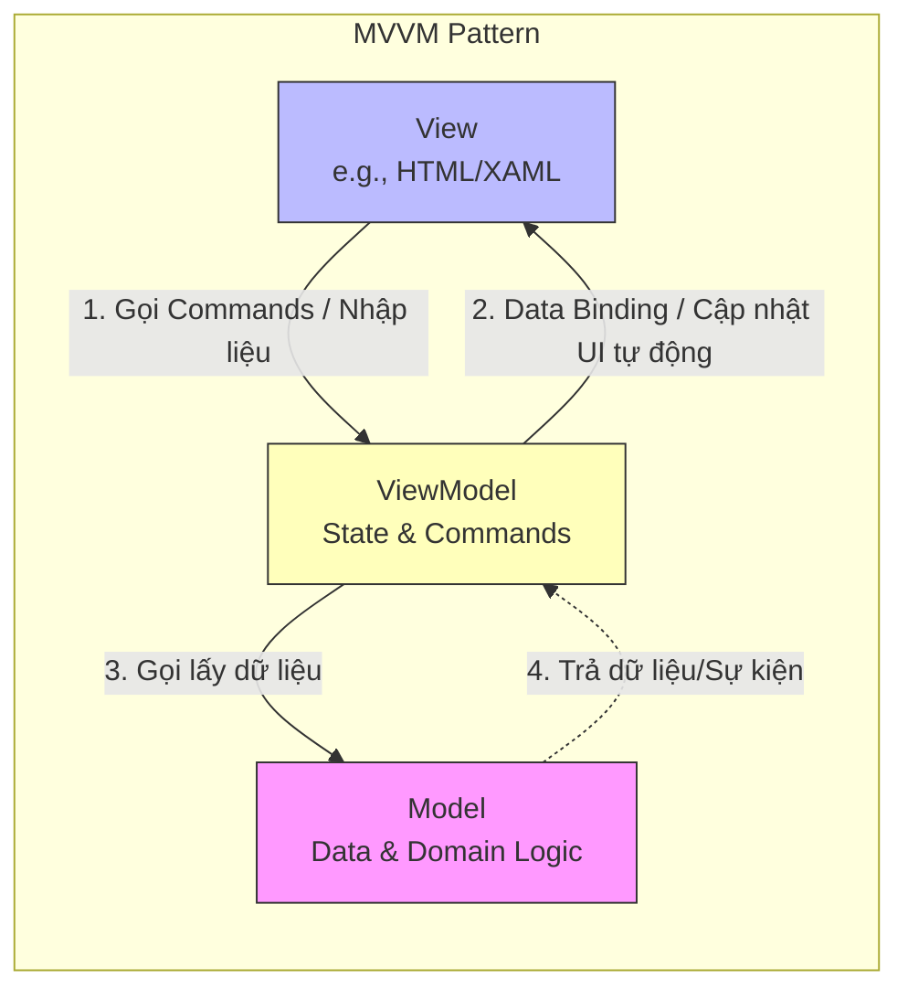

[Microsoft Learn - MVVM Pattern](https://learn.microsoft.com/en-us/dotnet/architecture/maui/mvvm) | [Wikipedia - Model-View-ViewModel](https://en.wikipedia.org/wiki/Model%E2%80%93view%E2%80%93viewmodel)

# Model-View-ViewModel (MVVM) Pattern

---

## Định nghĩa

**Model-View-ViewModel (MVVM)** là một mẫu kiến trúc phần mềm được thiết kế để tách biệt rõ ràng giữa giao diện người dùng (UI - View) và logic xử lý dữ liệu phía sau (ViewModel). MVVM tận dụng cơ chế liên kết dữ liệu (**Data Binding**) để tự động đồng bộ hóa trạng thái giữa View và ViewModel mà không cần sự can thiệp thủ công của lập trình viên.

---

## Đặc đặc điểm chính

Ba thành phần cốt lõi của MVVM bao gồm:
1. **Model:** Tương tự như trong MVC, Model đại diện cho dữ liệu thực tế và logic nghiệp vụ cốt lõi (truy xuất DB, gọi API).
2. **View:** Giao diện người dùng hiển thị cấu trúc trực quan (HTML, XML, XAML). View trong MVVM là hoàn toàn thụ động, nó định nghĩa các phần tử UI và khai báo liên kết (bind) các thuộc tính UI với các thuộc tính trong ViewModel.
3. **ViewModel:** Là một lớp trừu tượng đại diện cho trạng thái và logic của View. ViewModel chứa dữ liệu đã được định dạng sẵn sàng để View hiển thị và các lệnh (Commands) để View gọi khi người dùng tương tác. ViewModel **không chứa bất kỳ tham chiếu trực tiếp nào đến View** (không biết View là gì).

**Nguyên lý Data Binding:**
- **Two-Way Binding (Liên kết hai chiều):** Khi người dùng nhập liệu vào View (ví dụ: ô Input), dữ liệu trong ViewModel tự động cập nhật. Ngược lại, khi ViewModel thay đổi dữ liệu (ví dụ: tải xong dữ liệu từ API), View tự động vẽ lại giá trị mới.

---

## FLOW trực quan

Sơ đồ Mermaid dưới đây mô tả cấu trúc liên kết và luồng truyền dữ liệu tự động trong MVVM:



---

## Ưu điểm / Nhược điểm

> [!info] **Bảng so sánh chi tiết**
>
> | Tiêu chí | Ưu điểm | Nhược điểm |
> | :--- | :--- | :--- |
> | **Tính dễ kiểm thử (Testability)** | ViewModel không phụ thuộc vào View UI framework, giúp viết Unit Test cho logic của giao diện cực kỳ dễ dàng. | Tăng độ phức tạp khi thiết lập ban đầu (Boilerplate code cho việc config data binding). |
> | **Tách biệt vai trò** | UI Designer thiết kế View thoải mái, Developer chỉ tập trung code logic trong ViewModel và Model. | Khó debug: Khi xảy ra lỗi liên kết dữ liệu (binding error), lập trình viên khó tìm ra nguyên nhân do lỗi ở View hay ViewModel. |
> | **Trải nghiệm người dùng (UX)** | Rất phù hợp với các ứng dụng Client-Side (SPA, Mobile) mượt mà, phản hồi tức thì mà không cần load lại trang. | Tốn bộ nhớ hơn do phải duy trì các bộ lắng nghe sự kiện (Event Listeners) phục vụ cho Data Binding. |

---

## Khi nào nên dùng

- Phát triển ứng dụng Web Single Page Application (SPA) hiện đại (Angular, Vue.js, Knockout.js).
- Ứng dụng di động (Android với Jetpack Compose/Data Binding, iOS với Swift UI).
- Ứng dụng Desktop sử dụng Windows Presentation Foundation (WPF) hoặc .NET MAUI.

---

## Ví dụ minh hoá

Một ứng dụng nhập tên hiển thị lời chào viết bằng Vue.js (áp dụng MVVM):
- **View (HTML):**
  ```html
  <div id="app">
    <!-- Bind dữ liệu input với thuộc tính username trong ViewModel -->
    <input v-model="username" placeholder="Nhập tên của bạn">
    <!-- Hiển thị lời chào từ ViewModel -->
    <p>Chào mừng, {{ username }}!</p>
  </div>
  ```
- **ViewModel (JavaScript - Vue Instance):**
  ```javascript
  const app = Vue.createApp({
    data() {
        return {
            username: '' // Trạng thái này liên kết trực tiếp với ô Input ở View
        }
    }
  }).mount('#app');
  ```
- **Model:** Trong ví dụ đơn giản này, Model chỉ là dữ liệu thô nhận được từ API hoặc lưu tạm thời.

---

## Lưu ý

- **So sánh với MVC:**
  - Hãy nhớ: `[[05 - MVC]]` phù hợp nhất cho các ứng dụng Server-Side Rendering (nơi Controller tạo ra View hoàn chỉnh từ server). Còn **MVVM** sinh ra để phục vụ Client-Side Rendering (nơi View nằm sẵn trên máy khách và dữ liệu thay đổi linh hoạt qua API bất đồng bộ).
  - Khác biệt cốt lõi: MVVM loại bỏ hoàn toàn sự phụ thuộc trực tiếp của logic UI vào các phần tử giao diện thực tế nhờ cơ chế **Data Binding**.
