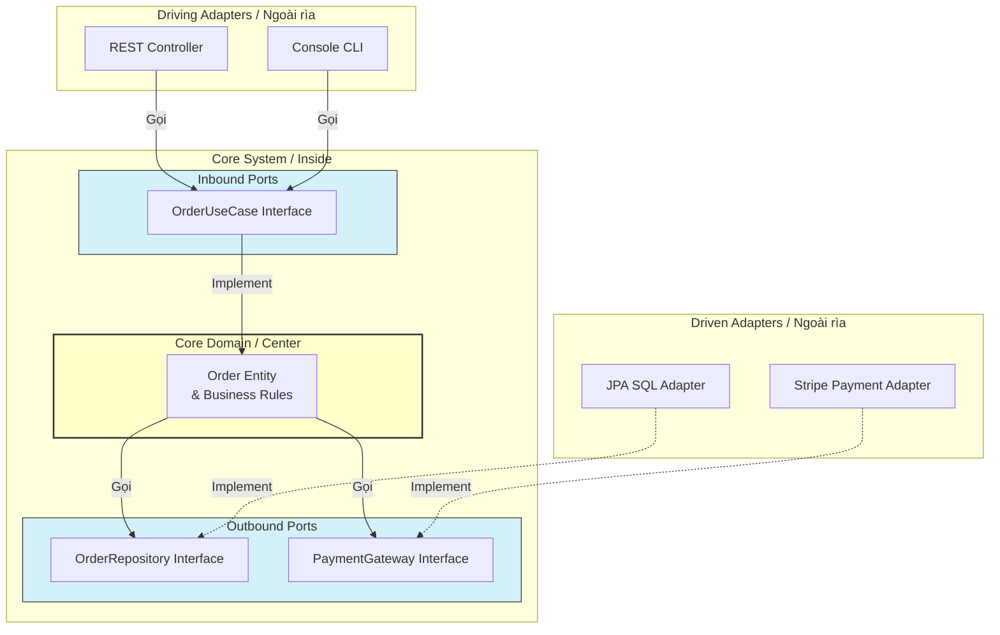

[Alistair Cockburn - Hexagonal Architecture](https://alistair.cockburn.us/hexagonal-architecture/) | [Baeldung - Hexagonal Architecture with Spring](https://www.baeldung.com/hexagonal-architecture-ddd-spring)

# Hexagonal Architecture (Ports and Adapters)

---

## Định nghĩa

**Hexagonal Architecture (Kiến trúc lục giác)**, còn được gọi là **Ports and Adapters Pattern**, là một kiến trúc hướng đối tượng tập trung vào Domain, được đề xuất bởi Alistair Cockburn. Mục tiêu cốt lõi của nó là cô lập logic nghiệp vụ trung tâm (Core Domain) khỏi tất cả các yếu tố công nghệ bên ngoài (giao diện người dùng, cơ sở dữ liệu, dịch vụ bên thứ ba) bằng cách kết nối qua các cổng (**Ports**) và bộ điều hợp (**Adapters**).

Hình lục giác (Hexagon) được dùng để đại diện trực quan cho hệ thống, cho thấy hệ thống có nhiều cổng kết nối khác nhau ở các cạnh bên ngoài.

---

## Đặc đặc điểm chính

Hệ thống được chia làm ba khu vực chính:
1. **Core Domain (Nhân nghiệp vụ):** Nằm ở trung tâm hình lục giác. Đây là nơi chứa logic nghiệp vụ thuần túy (Entities, Domain Services). Core Domain tuyệt đối không chứa bất kỳ framework, công nghệ hay thư viện kết nối cơ sở dữ liệu nào.
2. **Ports (Cổng giao tiếp):** Là các Interface định nghĩa giao thức giao tiếp với Core Domain.
   - **Inbound Ports / Driving Ports (Cổng đi vào):** Định nghĩa cách các tác nhân bên ngoài điều khiển hệ thống (ví dụ: Service Interfaces để Controller gọi).
   - **Outbound Ports / Driven Ports (Cổng đi ra):** Định nghĩa cách Core Domain yêu cầu dữ liệu hoặc dịch vụ từ bên ngoài (ví dụ: Repository Interfaces để truy xuất DB).
3. **Adapters (Bộ điều hợp):** Là các lớp cài đặt cụ thể xử lý công nghệ bên ngoài.
   - **Driving Adapters (Primary Adapters):** Nhận tương tác từ bên ngoài và chuyển thành lệnh gọi vào Core Domain qua Inbound Ports (ví dụ: REST Controller, CLI Console, Webpage).
   - **Driven Adapters (Secondary Adapters):** Hiện thực hóa (implement) Outbound Ports để kết nối Core Domain tới tài nguyên vật lý (ví dụ: SQL JPA Repository, REST Client gọi API bên thứ ba, Mail Sender).

**Nguyên lý hướng phụ thuộc (Dependency Rule):**
- Mọi sự phụ thuộc đều hướng vào trong (Inward Dependency). Các Adapters phụ thuộc vào Ports. Ports phụ thuộc vào Core Domain. Core Domain **không phụ thuộc** vào bất cứ thứ gì bên ngoài.

---

## FLOW trực quan

Sơ đồ Mermaid dưới đây mô tả cấu trúc hình lục giác với các Ports và Adapters xung quanh Core Domain:



---

## Ưu điểm / Nhược điểm

> [!info] **Bảng so sánh chi tiết**
>
> | Tiêu chí | Ưu điểm | Nhược điểm |
> | :--- | :--- | :--- |
> | **Độc lập công nghệ** | Có thể dễ dàng thay thế database (ví dụ: Postgres sang MongoDB) hoặc UI (REST sang GraphQL) chỉ bằng cách viết Adapter mới mà không cần chỉnh sửa một dòng code nghiệp vụ nào. | Cực kỳ phức tạp đối với các ứng dụng CRUD đơn giản, gây dư thừa các lớp Interface (Ports) và Mapping Objects. |
> | **Tính dễ kiểm thử** | Khả năng kiểm thử nghiệp vụ trung tâm đạt 100% bằng cách sử dụng mock/in-memory adapter cho Outbound Ports mà không cần chạy server hay DB thật. | Đòi hỏi lập trình viên phải có tư duy thiết kế tốt, nắm vững nguyên tắc SOLID và DDD để phân định đúng ranh giới. |
> | **Bảo trì lâu dài** | Logic nghiệp vụ được cô lập giúp tránh được hiện tượng "mã nguồn già cỗi" (legacy code bị khóa chặt vào framework cũ). | Việc map dữ liệu qua lại giữa Domain Object và Database/DTO Object gây tốn tài nguyên xử lý và công sức code. |

---

## Khi nào nên dùng

- Các ứng dụng lớn, có logic nghiệp vụ phức tạp và tuổi thọ hệ thống dài hạn (Enterprise Applications).
- Khi áp dụng mô hình Domain-Driven Design (DDD).
- Khi hệ thống cần tích hợp với rất nhiều bên thứ ba (nhiều Adapters) và các nhà cung cấp này có thể thay đổi liên tục.
- Khi yêu cầu viết Unit Test tự động cho logic nghiệp vụ là tối quan trọng.

---

## Ví dụ minh hoá

Mã nguồn Java mô tả cấu trúc của chức năng tạo đơn hàng:
- **Core Domain (Không có dependency bên ngoài):**
  ```java
  public class Order {
      private Long id;
      private List<OrderItem> items;
      public void calculateTotal() { /* Logic tính tiền đơn hàng */ }
  }
  ```
- **Outbound Port (Interface nằm trong core):**
  ```java
  public interface OrderRepositoryPort {
      void save(Order order);
  }
  ```
- **Driven Adapter (Cài đặt công nghệ nằm ngoài core):**
  ```java
  public class OrderJpaAdapter implements OrderRepositoryPort {
      @Autowired
      private SpringDataOrderRepository jpaRepo; // Thư viện Spring

      @Override
      public void save(Order order) {
          OrderEntity entity = convertToEntity(order); // Map Domain -> DB Entity
          jpaRepo.save(entity);
      }
  }
  ```

---

## Lưu ý

- **So sánh với Layered Architecture:** 
  - Khác biệt cốt lõi nằm ở **nguyên tắc đảo ngược phụ thuộc**. Trong `[[04 - Layered Architecture]]`, tầng nghiệp vụ phụ thuộc trực tiếp vào tầng dữ liệu. Trong Hexagonal, cả hai đều phụ thuộc vào Core Domain (thông qua interface Outbound Port).
- **So sánh với Clean Architecture:** 
  - `[[10 - Clean Architecture]]` (Kiến trúc sạch) và Hexagonal Architecture thực chất có chung một tư duy gốc: đặt Domain làm trung tâm và bảo vệ nó khỏi các công nghệ bên ngoài. Clean Architecture phân chia các lớp hình tròn đồng tâm rõ ràng hơn và chi tiết hơn (Entities, Use Cases, Controllers, Gateways) so với mô hình Ports-Adapters.
- **Ranh giới module:** Đừng để các thư viện bên ngoài (như Spring, Hibernate, JPA annotations) rò rỉ vào trong Core Domain. Core Domain chỉ nên chứa mã nguồn Java/Kotlin/C# thuần túy.
