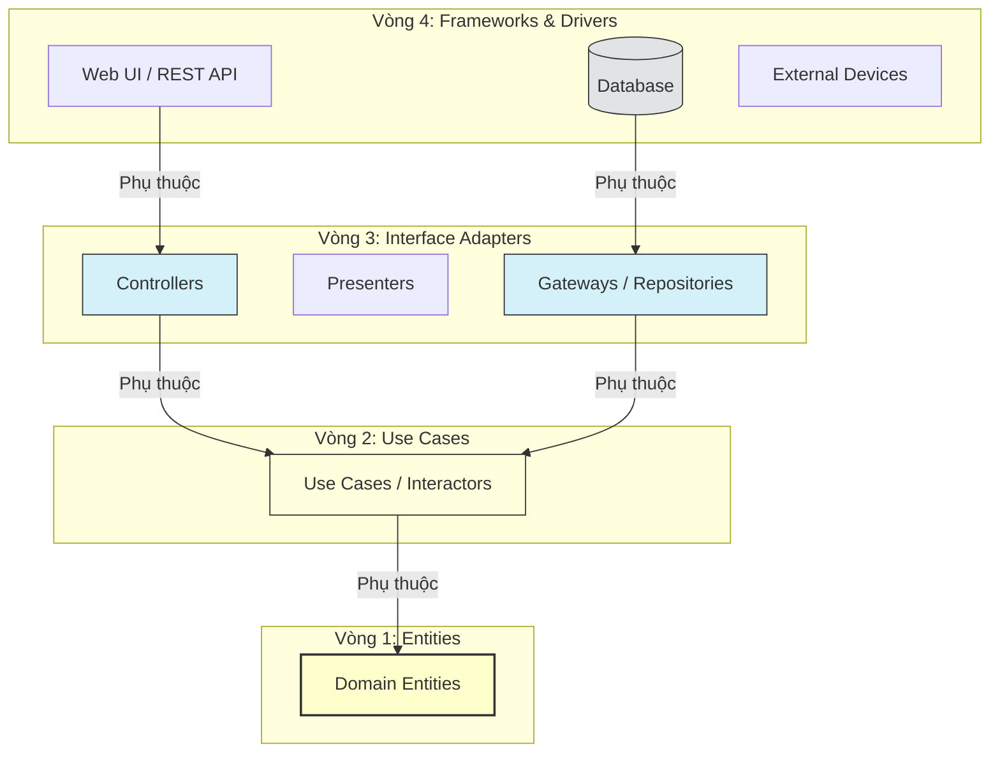

[Uncle Bob - The Clean Architecture](https://blog.cleancoder.com/uncle-bob/2012/08/13/the-clean-architecture.html) | [Baeldung - Clean Architecture Guide](https://www.baeldung.com/cs/clean-architecture-introduction)

# Clean Architecture

---

## Định nghĩa

**Clean Architecture (Kiến trúc sạch)** là một mô hình thiết kế phần mềm do Robert C. Martin (Uncle Bob) đề xuất vào năm 2012. Tương tự như kiến trúc lục giác, mục tiêu của Clean Architecture là tạo ra một hệ thống có tính tách biệt cao (Separation of Concerns), độc lập với các framework, cơ sở dữ liệu, giao diện người dùng và các tác nhân bên ngoài. 

Clean Architecture được mô tả trực quan thông qua các vòng tròn đồng tâm, trong đó các thành phần cốt lõi nằm ở trung tâm và các chi tiết công nghệ nằm ở các vòng ngoài cùng.

---

## Đặc đặc điểm chính

Hệ thống được chia làm bốn lớp vòng tròn đồng tâm từ trong ra ngoài:
1. **Entities (Thực thể nghiệp vụ - Vòng trong cùng):** Chứa các quy tắc nghiệp vụ cấp doanh nghiệp (Enterprise Business Rules). Đây là những đối tượng nghiệp vụ cốt lõi nhất, ít thay đổi nhất khi hệ thống có biến động về UI hay Database.
2. **Use Cases (Các ca sử dụng):** Chứa các quy tắc nghiệp vụ cụ thể của ứng dụng (Application Business Rules). Lớp này điều phối luồng dữ liệu đến và đi từ các Entities, thực hiện các kịch bản sử dụng của hệ thống (ví dụ: tạo tài khoản, chuyển tiền).
3. **Interface Adapters (Bộ chuyển đổi giao diện):** Chuyển đổi dữ liệu từ định dạng phù hợp nhất cho Use Cases/Entities sang định dạng phù hợp cho các framework bên ngoài (như DB hoặc Web). Lớp này chứa Controllers, Presenters, Gateways (như Repository Implementations).
4. **Frameworks & Drivers (Vòng ngoài cùng):** Chứa các công cụ, thư viện và chi tiết kỹ thuật như Hệ quản trị CSDL (SQL, MongoDB), UI Frameworks, Web Server, Devices...

**Quy tắc phụ thuộc cốt lõi (The Dependency Rule):**
- **Sự phụ thuộc chỉ đi từ ngoài vào trong (Inward Dependency Only).** Một thành phần thuộc vòng trong tuyệt đối không được biết và không được chứa bất kỳ tham chiếu nào đến các thành phần ở vòng ngoài (ví dụ: Entities không biết gì về Use Cases; Use Cases không biết gì về Controllers hay Database).

---

## FLOW trực quan

Sơ đồ Mermaid dưới đây biểu diễn các vòng tròn đồng tâm và chiều phụ thuộc của Clean Architecture:

---

## So sánh: Layered vs Hexagonal vs Clean Architecture

Để hiểu rõ hơn về các kiến trúc phân tách Concerns này, dưới đây là bảng so sánh chi tiết điểm khác biệt cốt lõi:

| Tiêu chí so sánh | Layered Architecture `[[04 - Layered Architecture]]` | Hexagonal Architecture `[[09 - Hexagonal Architecture]]` | Clean Architecture |
| :--- | :--- | :--- | :--- |
| **Hướng phụ thuộc (Dependency Direction)** | Từ trên xuống dưới (Top-Down). Nghiệp vụ phụ thuộc trực tiếp vào Database. | Từ ngoài vào trong (Inward). Mọi thứ phụ thuộc vào Core Domain. | Từ ngoài vào trong (Inward). Đi theo các vòng tròn đồng tâm vào Entities. |
| **Tâm điểm hệ thống (System Center)** | **Database-Centric** (Tập trung vào cấu trúc cơ sở dữ liệu vật lý). | **Domain-Centric** (Tập trung vào logic nghiệp vụ và các Ports). | **Domain-Centric** (Tập trung vào Entities và Use Cases độc lập). |
| **Phân chia các Lớp** | Thường chia thành 3 lớp cơ bản (Presentation, Service, Data Access). | Chia thành Core Domain, Ports (Interfaces) và Adapters (Cài đặt). | Chia thành 4 vòng tròn đồng tâm (Entities, Use Cases, Adapters, Frameworks). |
| **Mức độ linh hoạt (Flexibility)** | Thấp. Thay đổi Database hoặc UI kéo theo thay đổi ở toàn bộ các tầng phía trên. | Cao. Dễ dàng đổi công nghệ bên ngoài bằng cách thay Adapter mới. | Rất cao. Cách ly triệt để logic nghiệp vụ khỏi tất cả yếu tố công nghệ bên ngoài. |
| **Độ phức tạp (Complexity)** | Thấp. Dễ tiếp cận, ít boilerplate code, lý tưởng cho CRUD app nhỏ. | Trung bình - Cao. Đòi hỏi thiết kế Interface (Ports) cho mọi tương tác. | Cao. Đòi hỏi thiết kế chi tiết nhiều lớp, Data Mapper, DTO và phân chia thư mục nghiêm ngặt. |

---

## Ưu điểm / Nhược điểm

> [!info] **Bảng ưu nhược điểm**
>
> | Ưu điểm | Nhược điểm |
> | :--- | :--- |
> | **Độc lập Framework:** Nghiệp vụ không bị bắt làm "con tin" cho các framework cồng kềnh (như Spring, ASP.NET). | **Quá nhiều Boilerplate:** Hệ thống sinh ra rất nhiều lớp dữ liệu (Domain Entities, DB Entities, Request/Response DTOs) và phải viết code mapping liên tục. |
> | **Độc lập UI:** Dễ dàng chuyển đổi giao diện từ Web sang CLI hoặc Mobile App mà không cần đổi logic nghiệp vụ. | **Học tập khó khăn:** Đòi hỏi lập trình viên phải hiểu rõ nguyên lý SOLID, Dependency Inversion và thiết kế ranh giới hệ thống nghiêm ngặt. |
> | **Khả năng kiểm thử tối đa:** Lớp nghiệp vụ (Entities, Use Cases) có thể test độc lập nhanh chóng mà không cần DB hay Web Server chạy thật. | **Over-engineering:** Dễ rơi vào bẫy thiết kế quá phức tạp cho các tác vụ nghiệp vụ đơn giản. |

---

## Khi nào nên dùng

- Hệ thống lớn, cực kỳ phức tạp về nghiệp vụ (ví dụ: Hệ thống tài chính ngân hàng, bảo hiểm, ERP).
- Dự án có kế hoạch phát triển dài hạn (5-10 năm), dự kiến sẽ thay đổi công nghệ cơ sở hạ tầng nhiều lần.
- Các nhóm phát triển lớn muốn chia việc độc lập (nhóm làm UI riêng, nhóm làm Core nghiệp vụ riêng, nhóm làm Database riêng).

---

## Ví dụ minh hoá

Mô phỏng luồng đăng ký tài khoản (Register User):
1. **Frameworks & Drivers:** Người dùng gửi form HTML chứa email, password. Web server nhận request.
2. **Interface Adapters:** `UserController` đón nhận request, bóc tách dữ liệu và map thành `UserRegisterRequestModel` (DTO).
3. **Use Cases:** `UserController` gọi Use Case `RegisterUserInteractor`. Use Case này chịu trách nhiệm:
   - Kiểm tra xem email đã tồn tại chưa qua `UserRepositoryGateway` (Interface).
   - Mã hóa mật khẩu.
   - Tạo mới một `User` Entity.
   - Gọi `UserRepositoryGateway.save(user)` để lưu.
4. **Entities:** Lớp `User` chứa quy tắc: *"Email phải đúng định dạng và mật khẩu phải dài hơn 8 ký tự"*.
5. **Frameworks & Drivers:** Lớp cài đặt cụ thể `JpaUserRepositoryAdapter` (Interface Adapters) lưu dữ liệu vào MySQL Database vật lý.

---

## Lưu ý

- **Sự nhầm lẫn với Hexagonal Architecture:** Thực chất, Clean Architecture là một phiên bản chi tiết hóa và chuẩn hóa hơn của `[[09 - Hexagonal Architecture]]`. Ports trong Hexagonal tương ứng với Gateways/Interfaces ở lớp Use Cases của Clean Architecture. Adapters tương ứng với Interface Adapters ở vòng tròn thứ 3.
- **Dependency Inversion (DIP):** Để giữ cho chiều phụ thuộc luôn hướng vào trong khi Use Case cần gọi Database để lưu dữ liệu, Use Case định nghĩa một Interface (ví dụ: `UserRepositoryGateway` ở vòng trong). Lớp Database triển khai Interface này ở vòng ngoài. Nhờ đó, dòng điều khiển (Flow of Control) đi từ Use Case ra Database, nhưng dòng phụ thuộc (Flow of Dependency) lại đi ngược từ Database vào Use Case.
