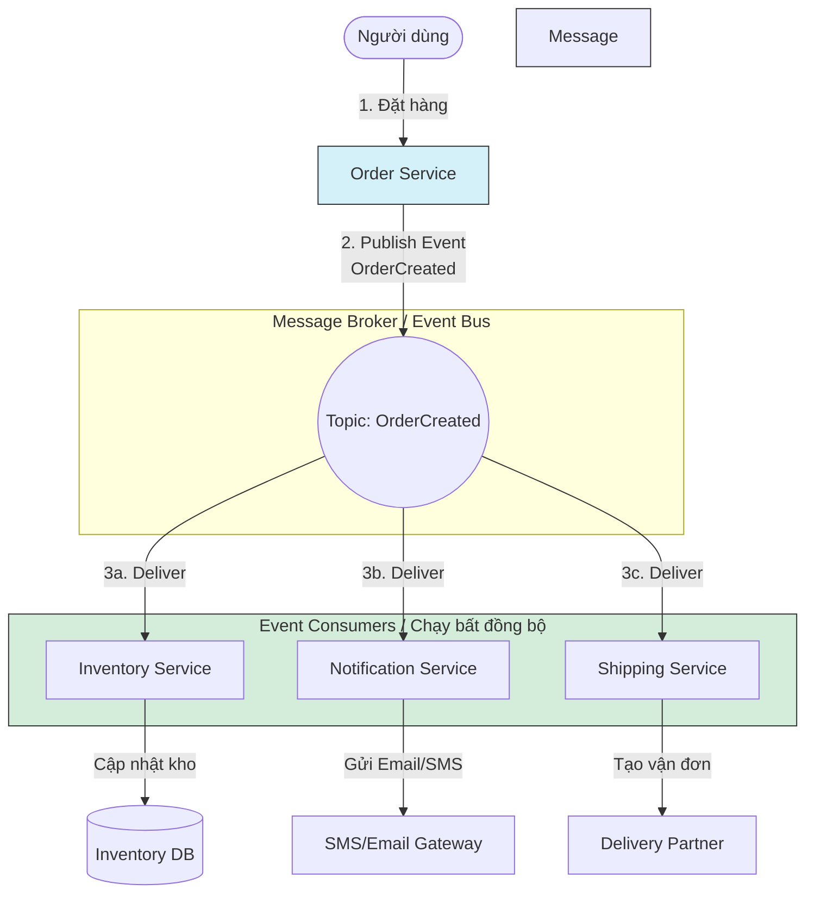

[Microsoft Learn - Event-driven architecture](https://learn.microsoft.com/en-us/azure/architecture/guide/architecture-styles/event-driven) | [AWS - What is an Event-Driven Architecture?](https://aws.amazon.com/event-driven-architecture/)

# Event-Driven Architecture

---

## Định nghĩa

**Event-Driven Architecture (Kiến trúc hướng sự kiện)** là một mẫu kiến trúc phần mềm trong đó các thành phần của hệ thống giao tiếp với nhau bằng cách sản sinh (Publish/Produce), phát hiện (Detect), tiêu thụ (Consume) và phản hồi lại các **Sự kiện (Events)** xảy ra trong hệ thống. 

Một "Sự kiện" đại diện cho một hành động hoặc một sự thay đổi trạng thái đã xảy ra trong quá khứ (ví dụ: *"Đơn hàng đã được thanh toán"*, *"Sản phẩm đã hết hàng"*).

---

## Đặc đặc điểm chính

Kiến trúc hướng sự kiện bao gồm ba thành phần cốt lõi:
1. **Event Producers (Bên phát sự kiện):** Nơi phát sinh ra sự kiện khi có một hành động xảy ra. Producer không biết ai sẽ nhận sự kiện và sự kiện đó sẽ được xử lý như thế nào.
2. **Event Channels / Routers (Kênh truyền dẫn/Bộ định tuyến):** Hệ thống trung gian (Message Broker) chịu trách nhiệm tiếp nhận sự kiện từ Producer, lưu trữ tạm thời và phân phối chúng đến đúng địa chỉ (ví dụ: Apache Kafka, RabbitMQ, AWS EventBridge).
3. **Event Consumers (Bên tiêu thụ sự kiện):** Các dịch vụ đăng ký lắng nghe các sự kiện cụ thể. Khi có sự kiện mới được gửi tới, Consumer tự động kích hoạt logic xử lý tương ứng.

**Hai mô hình giao tiếp chính:**
- **Publish/Subscribe (Pub/Sub):** Sự kiện được gửi tới một Topic. Tất cả các Consumer đăng ký Topic đó đều nhận được bản sao của sự kiện để xử lý song song.
- **Event Streaming:** Các sự kiện được ghi liên tục vào log theo trình tự thời gian. Consumer có thể đọc từ bất kỳ vị trí nào trong stream (phổ biến với Kafka).

---

## FLOW trực quan

Sơ đồ Mermaid dưới đây mô tả luồng xử lý bất đồng bộ khi người dùng mua hàng thành công trong hệ thống Event-Driven:



---

## Ưu điểm / Nhược điểm

> [!info] **Bảng so sánh chi tiết**
>
> | Tiêu chí | Ưu điểm | Nhược điểm |
> | :--- | :--- | :--- |
> | **Tính liên kết lỏng lẻo** | Các dịch vụ hoàn toàn độc lập với nhau (Decoupled). Order Service không cần biết Inventory Service có đang chạy hay không. | Hệ thống phức tạp: Khó debug và theo dõi luồng đi của dữ liệu do tính chất bất đồng bộ (Asynchronous). |
> | **Hiệu năng & Khả năng Scale** | Phản hồi người dùng cực nhanh (Non-blocking). Hệ thống xử lý các tác vụ nặng (gửi email, tạo vận đơn) ở chế độ nền (Background). | Tính nhất quán dữ liệu bị trễ (**Eventual Consistency**). Cơ sở dữ liệu của các service không được cập nhật ngay lập tức. |
> | **Khả năng phục hồi (Resiliency)** | Nếu một Consumer (như Notification Service) bị sập, sự kiện vẫn nằm trên Broker và sẽ được xử lý lại khi service hoạt động trở lại. | Nguy cơ mất sự kiện hoặc xử lý trùng lặp sự kiện (cần thiết kế hệ thống đảm bảo tính *Idempotent*). |

---

## Khi nào nên dùng

- Các hệ thống phân tán lớn, đa dịch vụ (`[[12 - Microservices]]`).
- Ứng dụng xử lý dữ liệu thời gian thực (Real-time Data Processing) như phân tích tài chính, theo dõi hành trình xe (Grab/Uber), thiết bị IoT.
- Khi cần tách biệt các tác vụ tốn thời gian khỏi luồng tương tác chính của người dùng (ví dụ: tạo file PDF báo cáo, gửi email xác nhận).
- Khi kết hợp với mô hình `[[11 - CQRS]]` để đồng bộ hóa dữ liệu giữa các database đọc và ghi.

---

## Ví dụ minh hoá

Trong một ứng dụng thương mại điện tử:
- Khi thanh toán thành công, **Order Service** cập nhật trạng thái đơn hàng trong DB của nó và đẩy sự kiện sau vào RabbitMQ:
  ```json
  {
    "eventId": "evt_98765",
    "eventType": "OrderPaid",
    "timestamp": "2026-08-22T00:16:00Z",
    "data": {
      "orderId": "ORD-12345",
      "userId": "usr_777",
      "amount": 150000
    }
  }
  ```
- **Notification Service** bắt được sự kiện này, lấy email người dùng từ `userId` và gửi hóa đơn.
- **Inventory Service** bắt được sự kiện này, giảm số lượng tồn kho của các sản phẩm trong đơn hàng.

---

## Lưu ý

- **Tránh nhầm lẫn Event vs Command:**
  - *Command* là một yêu cầu thực hiện hành động trong tương lai (ví dụ: `CreateOrder`). Nó có đích đến cụ thể (1 người nhận) và người gửi mong đợi kết quả trả về ngay.
  - *Event* là một thông báo về điều ĐÃ xảy ra trong quá khứ (ví dụ: `OrderCreated`). Nó không có đích đến cụ thể (ai muốn nhận thì đăng ký) và không mong đợi kết quả trả về trực tiếp.
- **Thiết kế Idempotency:** Trong môi trường mạng, việc một sự kiện bị gửi trùng lặp là hoàn toàn có thể xảy ra. Do đó, các Consumer **phải** được thiết kế sao cho dù nhận một sự kiện nhiều lần thì kết quả xử lý dữ liệu cuối cùng vẫn không thay đổi (Idempotent Consumer).
