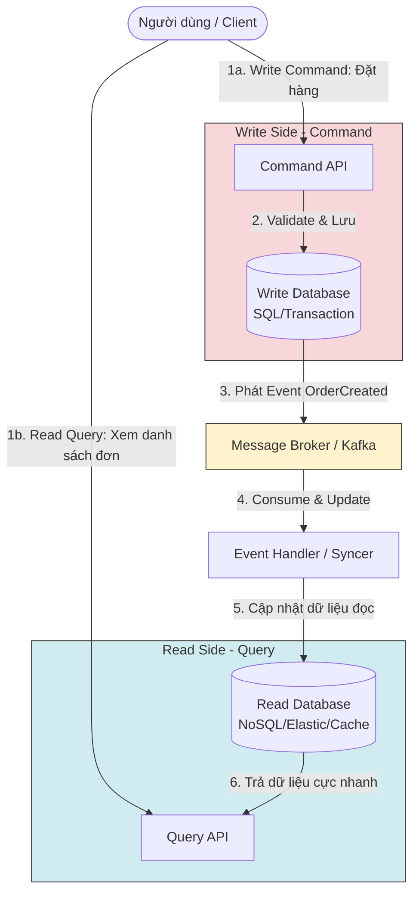

[Microsoft Learn - CQRS Pattern](https://learn.microsoft.com/en-us/azure/architecture/patterns/cqrs) | [Baeldung - CQRS and Event Sourcing](https://www.baeldung.com/cqrs-event-sourcing-architecture)

# CQRS (Command Query Responsibility Segregation)

---

## Định nghĩa

**CQRS (Command Query Responsibility Segregation - Phân tách Trách nhiệm Lệnh và Truy vấn)** là một mẫu kiến trúc phần mềm tách biệt hoàn toàn các thao tác sửa đổi dữ liệu (**Commands** - Lệnh) khỏi các thao tác đọc dữ liệu (**Queries** - Truy vấn). 

Bằng cách sử dụng các mô hình (Models) khác nhau để đọc và ghi dữ liệu, CQRS giúp tối ưu hóa hiệu năng, khả năng mở rộng (scalability) và tính bảo mật cho các hệ thống có lượng truy cập lớn hoặc nghiệp vụ phức tạp.

---

## Đặc đặc điểm chính

CQRS chia hệ thống làm hai nhánh xử lý riêng biệt:
1. **Command Side (Nhánh Ghi - Write Model):**
   - Chịu trách nhiệm thực hiện các hành động làm thay đổi trạng thái hệ thống (Create, Update, Delete).
   - Tập trung vào việc xác thực logic nghiệp vụ phức tạp (Domain Logic).
   - Thường sử dụng cơ sở dữ liệu quan hệ (RDBMS) chuẩn hóa cao (Normalized) để đảm bảo tính toàn vẹn dữ liệu (ACID).
2. **Query Side (Nhánh Đọc - Read Model):**
   - Chịu trách nhiệm truy vấn và trả về dữ liệu cho người dùng (Read/Select).
   - Không thực hiện bất kỳ thay đổi dữ liệu nào.
   - Tập trung vào tốc độ phản hồi. Dữ liệu thường được phi chuẩn hóa (Denormalized) và lưu trong các NoSQL DB hoặc Cache (Redis, Elasticsearch) tối ưu cho việc tìm kiếm.

**Đồng bộ dữ liệu (Synchronization):**
- Khi Nhánh Ghi hoàn thành một Command, nó phát đi một Sự kiện (Event).
- Một bộ xử lý sự kiện (Event Handler) lắng nghe sự kiện này và cập nhật dữ liệu tương ứng sang Nhánh Đọc. Quá trình này diễn ra bất đồng bộ, chấp nhận **tính nhất quán trễ (Eventual Consistency)**.

---

## FLOW trực quan

Sơ đồ Mermaid dưới đây mô tả luồng hoạt động của một hệ thống áp dụng CQRS kết hợp Event-Driven để đồng bộ dữ liệu:



---

## Ưu điểm / Nhược điểm

> [!info] **Bảng so sánh chi tiết**
>
> | Tiêu chí | Ưu điểm | Nhược điểm |
> | :--- | :--- | :--- |
> | **Tối ưu hóa độc lập** | Có thể scale độc lập nhánh đọc và nhánh ghi. Trong thực tế, lượng đọc thường gấp 10-100 lần lượng ghi. | Tăng độ phức tạp của mã nguồn và hạ tầng (phải quản lý nhiều loại database, message broker). |
> | **Tối ưu hóa database** | Nhánh ghi dùng RDBMS chặt chẽ. Nhánh đọc dùng NoSQL/Elasticsearch hỗ trợ tìm kiếm toàn văn siêu nhanh. | **Trễ đồng bộ:** Người dùng có thể không nhìn thấy dữ liệu họ vừa tạo lập tức do độ trễ truyền sự kiện qua mạng. |
> | **Mã nguồn rõ ràng** | Tách biệt hoàn toàn luồng xử lý giúp code dễ bảo trì hơn, giảm thiểu các câu lệnh SQL JOIN quá phức tạp. | Khó triển khai cơ chế Rollback (như 2PC) nếu có lỗi xảy ra ở nhánh đọc sau khi nhánh ghi đã thành công. |

---

## Khi nào nên dùng

- Các hệ thống thương mại điện tử lớn có tần suất đọc dữ liệu (xem sản phẩm, tìm kiếm) lớn hơn rất nhiều so với ghi dữ liệu (đặt hàng).
- Hệ thống có logic nghiệp vụ ghi dữ liệu cực kỳ phức tạp (phải check nhiều điều kiện), còn nghiệp vụ đọc lại cần dữ liệu tổng hợp từ nhiều nguồn khác nhau.
- Khi xây dựng kiến trúc Microservices phân tán (`[[12 - Microservices]]`).
- Thường kết hợp với **Event Sourcing Pattern** (lưu trữ toàn bộ lịch sử sự kiện thay vì trạng thái hiện tại).

---

## Ví dụ minh hoá

Mô tả lớp xử lý trong một ứng dụng Spring Boot:
- **Command:** Lớp thay đổi địa chỉ của khách hàng:
  ```java
  public class UpdateAddressCommand {
      private Long userId;
      private String newAddress;
      // Constructor, getters
  }
  ```
- **Query:** Lớp yêu cầu lấy thông tin hiển thị của khách hàng:
  ```java
  public class GetUserProfileQuery {
      private Long userId;
      // Constructor, getters
  }
  ```
- **Sử dụng:** Lập trình viên sử dụng thư viện như **Axon Framework** để định tuyến Commands tới Command Handlers và Queries tới Query Handlers riêng biệt, không dùng chung một class Service như truyền thống.

---

## Lưu ý

- **Liên hệ với Event-Driven:**
  - CQRS rất hay đi đôi với `[[10 - Event-Driven]]` để giải quyết bài toán đồng bộ dữ liệu. Nhánh Ghi sau khi hoàn thành nhiệm vụ sẽ đẩy event vào Message Broker để Nhánh Đọc cập nhật.
- **Không áp dụng bừa bãi:** CQRS không phải là một kiến trúc tổng thể (Global Architecture) cho toàn bộ ứng dụng. Chỉ áp dụng CQRS cho những **Bounded Context** (phân vùng nghiệp vụ) thực sự gặp bài toán về hiệu năng đọc/ghi hoặc có nghiệp vụ quá phức tạp. Đừng cố áp dụng cho các module CRUD đơn giản.
