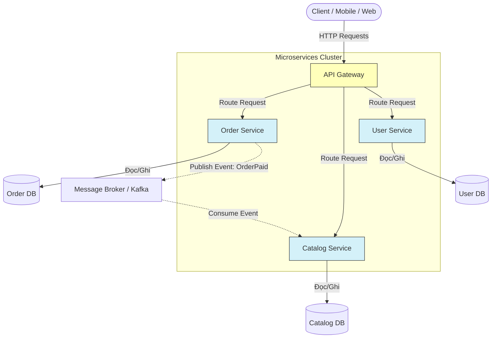

[Martin Fowler - Microservices](https://martinfowler.com/articles/microservices.html) | [Microsoft Learn - Microservices Architecture](https://learn.microsoft.com/en-us/azure/architecture/guide/architecture-styles/microservices)

# Microservices Architecture

---

## Định nghĩa

**Microservices Architecture (Kiến trúc vi dịch vụ)** là một mẫu thiết kế kiến trúc phần mềm phân tán, trong đó một ứng dụng lớn được chia nhỏ thành một tập hợp các dịch vụ nhỏ (Services) độc lập. Mỗi dịch vụ chạy trong một tiến trình riêng, tập trung giải quyết một chức năng nghiệp vụ duy nhất (Single Responsibility) và giao tiếp với nhau thông qua các giao thức mạng gọn nhẹ (như HTTP REST API, gRPC, hoặc Message Broker).

---

## Đặc đặc điểm chính

- **Cơ sở dữ liệu riêng biệt (Database per Service):** Mỗi microservice tự quản lý và sở hữu cơ sở dữ liệu riêng của mình. Một service không được phép truy cập trực tiếp vào DB của service khác.
- **Triển khai độc lập (Autonomous Deployment):** Mỗi dịch vụ có thể được build, test và deploy lên production hoàn toàn độc lập mà không cần deploy lại toàn bộ hệ thống.
- ** Stack công nghệ đa dạng (Polyglot):** Có thể sử dụng ngôn ngữ lập trình, thư viện và database khác nhau cho từng service tùy thuộc vào nhiệm vụ (ví dụ: Service A dùng Java/MySQL, Service B dùng Python/MongoDB).
- **Phân ranh giới theo Domain (Domain-Driven Design):** Các service được thiết kế bám sát theo các ranh giới nghiệp vụ (Bounded Contexts).

---

## FLOW trực quan

Sơ đồ Mermaid dưới đây mô tả kiến trúc của một hệ thống Microservices thông qua API Gateway:

---

## Ưu điểm / Nhược điểm

> [!info] **Bảng so sánh chi tiết**
>
> | Tiêu chí | Ưu điểm | Nhược điểm |
> | :--- | :--- | :--- |
> | **Scale linh hoạt** | Có thể scale riêng dịch vụ đang bị nghẽn (ví dụ: chỉ scale up Catalog Service vào ngày Black Friday). | Độ phức tạp vận hành cực cao (phải quản lý Kubernetes, Docker, CI/CD pipelines, Service Mesh...). |
> | **Cô lập lỗi** | Nếu một dịch vụ bị lỗi (OutOfMemory), các dịch vụ khác vẫn hoạt động bình thường, người dùng vẫn có thể duyệt sản phẩm. | Độ trễ mạng (Network Latency) tăng do các service phải gọi nhau qua mạng thay vì gọi hàm trong bộ nhớ. |
> | **Phát triển song song** | Các team lớn có thể chia ra làm việc trên các service khác nhau mà không sợ conflict code. | Khó quản lý giao dịch phân tán (Distributed Transactions). Phải áp dụng *Saga Pattern* thay vì ACID truyền thống. |

---

## Khi nào nên dùng

- Các ứng dụng lớn, cực kỳ phức tạp và được phát triển bởi các tổ chức có quy mô lớn (hàng chục đến hàng trăm kỹ sư).
- Khi ứng dụng yêu cầu khả năng scale cực cao và tính sẵn sàng (uptime) gần như tuyệt đối (ví dụ: Netflix, Amazon, Uber).
- Khi hệ thống có các thành phần đòi hỏi các stack công nghệ khác nhau (ví dụ: module AI cần Python, module cổng thanh toán cần Java).

---

## Ví dụ minh hoá

Hệ thống của Netflix:
- Khi bạn mở ứng dụng Netflix trên TV, API Gateway tiếp nhận yêu cầu.
- **Account Service** xác thực tài khoản của bạn.
- **Recommendation Service** (viết bằng Python/Machine Learning) gợi ý danh sách phim nên xem.
- **Streaming Service** chịu trách nhiệm truyền tải luồng video chất lượng cao từ CDN về máy.
- Mặc dù Recommendation Service có thể gặp lỗi và không hiển thị danh sách gợi ý, bạn vẫn có thể đăng nhập và xem tiếp bộ phim đang xem dở nhờ Account Service và Streaming Service hoạt động bình thường.

---

## Lưu ý

- **So sánh với Monolithic:**
  - Microservices là sự tiến hóa để giải quyết các vấn đề mở rộng quy mô của `[[03 - Monolithic]]`. Tuy nhiên, chuyển đổi từ Monolithic sang Microservices quá sớm (khi dự án còn nhỏ, nghiệp vụ chưa rõ ràng) là một sai lầm phổ biến (**Over-engineering**).
  - Có một nguyên tắc vàng: *"Đừng bắt đầu với Microservices. Hãy bắt đầu với một Monolithic được thiết kế tốt, chia module rõ ràng (Modular Monolith), sau đó tách dần các module ra thành Microservices khi thực sự cần thiết."*
- **Database per Service:** Đây là nguyên tắc bắt buộc. Nếu bạn xây dựng nhiều dịch vụ nhưng chúng vẫn truy cập chung vào một cơ sở dữ liệu vật lý duy nhất, bạn đang tạo ra một **Distributed Monolith** (nguyên khối phân tán) - mô hình tệ nhất vì nó mang toàn bộ nhược điểm của cả hai kiến trúc.
